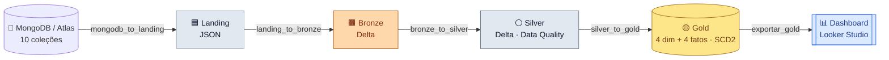

<div align="center">

# 🛒 Engenharia de Dados — Pipeline E-commerce

**Trabalho Final — Arquitetura Medalhão de ponta a ponta**

Integrantes: **Guilherme Madalena · Gustavo Felisbino · Lucas Gaspar · Lucas Oliverio · Luiz Barros · Tiago Mazzuco**

---

[](https://www.mongodb.com/atlas)
[](https://airflow.apache.org/)
[](https://spark.apache.org/)
[](https://delta.io/)
[](https://min.io/)
[](https://www.python.org/)
[](https://olucasoliverio.github.io/Engenharia_Dados_Final/)
[](https://lookerstudio.google.com/reporting/24b9c057-5b46-46af-bff3-54688322858e)
[](LICENSE)

</div>

> [!NOTE]
> Este README é o **manual operacional** — o que é o projeto, como subir e como rodar.
> A **explicação conceitual completa** (arquitetura, decisões, cada camada e DAG, com
> diagramas e o código embutido) está na documentação **MkDocs**:
> **<https://olucasoliverio.github.io/Engenharia_Dados_Final/>**

---

## 📋 Sobre o projeto

Pipeline de dados **end-to-end** de um **e-commerce fictício**, implementando a
**arquitetura Medalhão** (Landing → Bronze → Silver → Gold) sobre um **Data Lake**
em object storage, com origem **NoSQL (MongoDB)**, orquestração em **Apache Airflow**,
transformação em **Apache Spark / Delta Lake** e entrega em **modelo dimensional**
consumido por um **dashboard no Looker Studio**.

**Domínio:** e-commerce — 10 coleções (clientes, categorias, fornecedores, produtos,
cupons, pedidos, itens_pedido, pagamentos, entregas, avaliações).

### 🎯 Cobertura do enunciado

| Requisito | Onde |
|---|---|
| Origem **NoSQL** (≥10 coleções, ~15k docs, datas em ~3 anos, Faker) | `dataset/` · [docs](https://olucasoliverio.github.io/Engenharia_Dados_Final/modelo_mongodb/) |
| **Orquestração** (sem cron/Windows) | Apache Airflow — `dags/` (4 DAGs) |
| **Data Lake** em object storage + **medalhão** | MinIO — camadas Landing/Bronze/Silver/Gold |
| **Delta Lake** em Bronze/Silver/Gold · JSON na Landing | `spark_jobs/` |
| Motor de transformação **Apache Spark** | PySpark — `spark_jobs/` |
| **Modelo dimensional** (fatos + dimensões) | Gold — 4 dimensões + 4 fatos |
| **SCD Tipo 2** nas dimensões · checkpoint incremental | `silver_to_gold` · `mongodb_to_landing` |
| **Dashboard** One Page View — 4 KPIs + 2 métricas | [Looker Studio](https://lookerstudio.google.com/reporting/24b9c057-5b46-46af-bff3-54688322858e) · `scripts/exportar_gold.py` |
| **GitHub**: PRs, issues, branch protegida, **MkDocs**, **CI** | `.github/workflows/` · gh-pages |

---

## 🏗️ Arquitetura



Orquestração: **4 DAGs** do Airflow, agendadas em sequência e com carga incremental
por `updated_at`.

---

## 🧰 Stack e versões

| Componente | Versão | Papel |
|---|---|---|
| **MongoDB** | 7 (local) / Atlas M0 | Origem NoSQL |
| **MinIO** | S3-compatible | Object storage do Data Lake |
| **Apache Airflow** | 3.2 | Orquestração (4 DAGs) |
| **Apache Spark / PySpark** | 3.5.3 | Transformações |
| **Delta Lake** | 3.3.1 | Formato Bronze/Silver/Gold |
| **PostgreSQL** | 16 | Metastore do Airflow |
| **Python** | ≥ 3.11 | Scripts e jobs |
| **MkDocs Material** | 9.5+ | Documentação (gh-pages) |
| **Looker Studio** | — | Dashboard final |

> Dependências num único **`pyproject.toml`** com grupos opcionais
> (`.[dataset]`, `.[infra]`, `.[spark]`, `.[airflow]`, `.[docs]`).

---

## ✅ Pré-requisitos

| Ferramenta | Notas |
|---|---|
| **Docker + Docker Compose** | Sobe MongoDB, MinIO, Airflow e Postgres |
| **Python 3.11+** | Scripts locais (carga, export). Use um `venv` |
| **Git** | Clonar o repositório |

> Os dados (`dataset/arquivos_csv/`) e a saída do dashboard (`gold_export/`) **não são
> versionados** — são reproduzíveis pelos scripts.

---

## 🚀 Como rodar

### 1. Clonar e configurar
```bash
git clone https://github.com/olucasoliverio/Engenharia_Dados_Final.git
cd Engenharia_Dados_Final
cp .env.example .env            # ajuste credenciais se quiser
```

### 2. Subir o MongoDB e popular a origem
```bash
docker compose up -d mongodb

python3 -m venv .venv && source .venv/bin/activate
pip install ".[dataset]"

# gera os CSVs (se faltarem) e carrega as 10 coleções num passo só
python dataset/scripts_py/carregar_mongo.py
```

### 3. Subir o Data Lake + Airflow e rodar o pipeline
```bash
docker compose up -d --build minio airflow-apiserver airflow-scheduler \
  airflow-dag-processor airflow-triggerer
```
- Airflow: <http://localhost:8080> (usuário/senha padrão: `airflow` / `airflow`)
- MinIO Console: <http://localhost:9001> (`minioadmin` / `minioadmin`)

Ative e dispare as DAGs na ordem: `mongodb_to_landing → landing_to_bronze →
bronze_to_silver → silver_to_gold`.

### 4. Exportar a Gold para o dashboard
```bash
pip install ".[spark]"
python scripts/exportar_gold.py     # gera gold_export/ (estrela + obt_vendas.csv)
```
Importe `gold_export/obt_vendas.csv` no **Looker Studio**. Passo a passo, relações e as
medidas (KPIs) em [`docs/dashboard.md`](https://olucasoliverio.github.io/Engenharia_Dados_Final/dashboard/).

### 5. Testes
```bash
python -m unittest discover -s tests -v
```

---

## 📁 Estrutura do repositório

```
.
├── dags/             # DAGs do Airflow (+ lib/)  — orquestração das 4 etapas
├── spark_jobs/       # Jobs PySpark (landing→bronze→silver→gold)
├── scripts/          # Infra do Data Lake (criar_estrutura_*) + exportar_gold
├── dataset/          # Geradores Faker, carregar_mongo e validadores ($jsonSchema)
├── config/           # Contratos das camadas (*_structure.json)
├── docs/             # Documentação MkDocs (publicada no gh-pages)
├── notebooks/        # Documentação interativa em Jupyter (10 notebooks)
├── tests/            # Testes unitários (rodam no CI)
├── docker/           # Dockerfile.airflow
├── assets/           # Diagramas de arquitetura
├── docker-compose.yml
├── pyproject.toml    # Dependências (grupos opcionais)
├── mkdocs.yml
└── README.md
```

---

## 📚 Documentação e Dashboard

| Recurso | Link |
|---|---|
| 📖 **Documentação (MkDocs)** | <https://olucasoliverio.github.io/Engenharia_Dados_Final/> |
| 📊 **Dashboard (Looker Studio)** | <https://lookerstudio.google.com/reporting/24b9c057-5b46-46af-bff3-54688322858e> |
| 🗂️ **Repositório** | <https://github.com/olucasoliverio/Engenharia_Dados_Final> |

---

## 📊 Dashboard — KPIs e métricas

One Page View no Looker Studio, consumindo o modelo da Gold:

- **KPIs:** Faturamento total · Quantidade de pedidos · Ticket médio · % de pedidos entregues
- **Métricas:** Faturamento por mês · Produtos mais vendidos
- **Filtros:** período · categoria · estado · forma de pagamento

---

## 📓 Notebooks (Jupyter)

A pasta `notebooks/` traz a **documentação interativa** do projeto em 10 notebooks
Jupyter — uma narrativa navegável que complementa o MkDocs:

| Notebook | Conteúdo |
|---|---|
| `00_indice_documentacao` | Índice / ponto de partida |
| `01_visao_geral_projeto` | Visão geral do pipeline |
| `02_estrutura_repositorio` | Organização do repositório |
| `03_arquitetura_detalhada` | Arquitetura medalhão em detalhe |
| `04_processos_negocio` | Processos de negócio |
| `05_fluxo_dados` | Fluxo de dados ponta a ponta |
| `06_banco_dados` | Camada de origem (MongoDB) |
| `07_interfaces_apis` | Interfaces e APIs |
| `08_infraestrutura` | Infraestrutura (Docker/MinIO/Airflow) |
| `09_execucao_pipeline` | Guia prático de execução |

```bash
pip install ".[notebooks]"     # instala notebook + jupyterlab
jupyter lab                    # abre o Jupyter no navegador (ou: jupyter notebook)
```
Abra `notebooks/00_indice_documentacao.ipynb` para começar.

---

## 👥 Integrantes

Guilherme Madalena · Gustavo Felisbino · Lucas Gaspar · Lucas Oliverio · Luiz Barros · Tiago Mazzuco

## 📄 Licença

Distribuído sob a licença **MIT** — veja [LICENSE](LICENSE).
