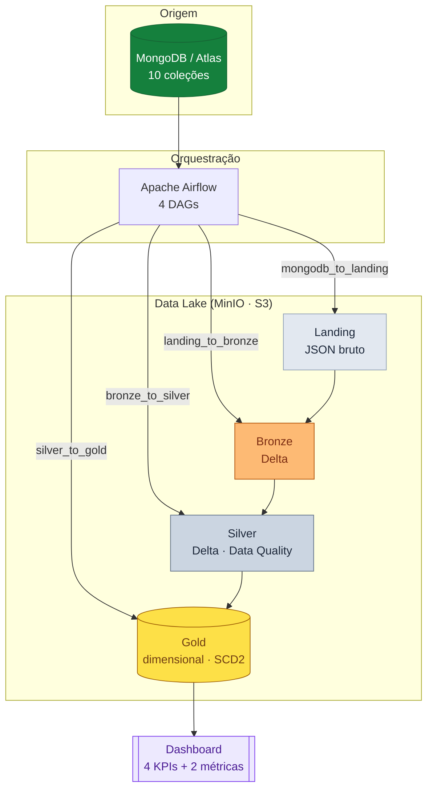

---
tags:
  - arquitetura
  - medalhão
---

# Arquitetura da solução

Visão geral de ponta a ponta: da origem **NoSQL** até o **modelo dimensional**
consumido pelo dashboard, seguindo a arquitetura **Medalhão** sobre um Data Lake.

## :material-sitemap: Fluxo completo

## :material-format-list-checks: Princípios de design

| Decisão | Escolha | Por quê |
|---|---|---|
| Origem | MongoDB (NoSQL) | Cenário realista de dados semiestruturados |
| Object storage | MinIO (S3-compatible) | Data Lake local, portável para a nuvem |
| Orquestração | Apache Airflow | Agendamento e dependências entre etapas (sem cron/Windows) |
| Formato analítico | Delta Lake | ACID, `MERGE`, time-travel e schema enforcement |
| Camadas | Landing · Bronze · Silver · Gold | Separação de responsabilidades (medalhão) |
| Modelagem Gold | Dimensional (Kimball) | Fatos e dimensões prontos para BI |
| Histórico | SCD Tipo 2 nas dimensões | Preserva versões dos atributos ao longo do tempo |
| Incremental | `updated_at` + checkpoints | Reprocessa apenas o que mudou |

## :material-layers-triple: Responsabilidade de cada camada

- **Landing** — cópia fiel da origem em **JSON**
  (Extended JSON), sem transformação. [:octicons-arrow-right-24: detalhes](estrutura_landing.md)
- **Bronze** — JSON → **Delta**, com metadados de
  auditoria e idempotência por arquivo. [:octicons-arrow-right-24: detalhes](estrutura_bronze.md)
- **Silver** — limpeza, tipagem, validações e
  integridade referencial. [:octicons-arrow-right-24: detalhes](estrutura_silver.md)
- **Gold** — modelo dimensional (4 dimensões + 4
  fatos), SCD Tipo 2. [:octicons-arrow-right-24: detalhes](estrutura_gold.md)

## :material-image-multiple: Diagramas

Diagramas de arquitetura versionados no repositório (em `assets/`):

- [Arquitetura do projeto](https://github.com/olucasoliverio/Engenharia_Dados_Final/blob/main/assets/architecture_project.jpg)
- [Arquitetura — MongoDB](https://github.com/olucasoliverio/Engenharia_Dados_Final/blob/main/assets/architecture_mongoDB.jpg)
- [Board no Miro](https://miro.com/app/board/uXjVHEnXdmQ=/)

## Referências

- [The Data Engineering Cookbook — Medallion Architecture](https://docs.databricks.com/lakehouse/medallion.html)
- [Delta Lake](https://docs.delta.io/latest/index.html)
- [Apache Airflow — Concepts](https://airflow.apache.org/docs/apache-airflow/stable/core-concepts/index.html)
- Página completa de [referências](referencias.md)
