# DAG Bronze → Silver

Implementação da **Issue #17**, responsável por limpar e padronizar as tabelas
Delta da Bronze e materializar a fonte corporativa validada na Silver.

## Fluxo

```mermaid
flowchart LR
    A[Validar Bronze e estrutura Silver] --> B[Submeter job Spark]
    B --> C[Ler Delta Bronze]
    C --> D[Interpretar Extended JSON]
    D --> E[Padronizar tipos e valores]
    E --> F[Deduplicar por chave e updated_at]
    F --> G[Validar campos e relacionamentos]
    G --> H[MERGE nas tabelas Silver]
    H --> I[Gravar manifesto de auditoria]
```



## Arquivos

| Arquivo | Responsabilidade |
|---|---|
| `dags/bronze_to_silver.py` | Orquestração pelo Airflow |
| `dags/lib/bronze_silver.py` | Contratos, regras, caminhos e manifesto |
| `spark_jobs/bronze_to_silver.py` | Limpeza, validação e `MERGE` PySpark |
| `tests/test_bronze_silver.py` | Testes unitários dos contratos |

## Agendamento

O fluxo padrão deixa cinco minutos entre as etapas:

```text
MongoDB → Landing:  */15 * * * *
Landing → Bronze:   5-59/15 * * * *
Bronze → Silver:    10-59/15 * * * *
```

O processamento é idempotente. Uma nova execução compara a chave primária, o
`updated_at` e o hash do registro antes de alterar a tabela Silver.

## Configuração

| Variável | Padrão |
|---|---|
| `SPARK_CONN_ID` | `spark_default` |
| `SPARK_S3_ENDPOINT` | `http://minio:9000` |
| `SPARK_LOG_LEVEL` | `WARN` |
| `SILVER_TABLES` | Dez tabelas do e-commerce |
| `BRONZE_TO_SILVER_APPLICATION` | `/opt/airflow/spark_jobs/bronze_to_silver.py` |
| `BRONZE_TO_SILVER_SCHEDULE` | `10-59/15 * * * *` |

O ambiente utiliza Spark `3.5.3`, Delta Lake `3.3.1` e Hadoop AWS `3.3.4`,
conforme os requirements e pacotes definidos pela DAG Landing → Bronze.

## Regras de qualidade

As regras versionadas em `dags/lib/bronze_silver.py` definem, para cada
entidade:

- chave primária;
- campos obrigatórios e opcionais;
- tipo corporativo de destino;
- normalização de strings e documentos;
- valores permitidos e limites numéricos;
- chaves estrangeiras e ordem de dependência.

Somente `pedidos.id_cupom` e `entregas.data_entrega_real` aceitam nulos.

### Padronizações

| Categoria | Regra |
|---|---|
| IDs e quantidades | `long` |
| Valores monetários | `decimal(18,2)` |
| Percentuais | `decimal(5,2)` ou inteiro |
| Datas de negócio | `date` |
| `updated_at` | `timestamp` UTC |
| CPF, CNPJ, CEP e telefone | somente dígitos |
| E-mails e status | minúsculos |
| UF, cupom e rastreio | maiúsculos |

Domínios de gênero, status, pagamento, entrega e transportadora são validados.
Valores negativos, notas fora de `1..5`, parcelas fora de `1..12` e
relacionamentos inexistentes são rejeitados.

As tabelas permanecem sem particionamento físico porque cada entidade possui
15.000 registros. Essa escolha evita partições pequenas; o Delta Lake continua
fornecendo transações ACID e evolução incremental por `MERGE`.

## Deduplicação

A Bronze mantém o histórico por arquivo e pode conter documentos repetidos
pela janela de sobreposição da extração. A Silver mantém uma linha por chave
primária:

1. maior `updated_at`;
2. maior horário de ingestão Bronze em caso de empate;
3. arquivo de origem como desempate determinístico.

## Merge incremental

Na primeira execução, as tabelas Delta são criadas. Nas seguintes, o job:

- insere chaves novas;
- atualiza registros com `updated_at` maior;
- atualiza registros com mesmo `updated_at` somente se o hash mudou;
- não grava registros que já representam o estado atual.

Metadados adicionados:

| Coluna | Descrição |
|---|---|
| `_silver_source_file` | Arquivo Landing que originou o registro |
| `_silver_source_ingested_at` | Ingestão correspondente na Bronze |
| `_silver_record_hash` | Hash dos campos corporativos |
| `_silver_airflow_run_id` | Execução que inseriu ou atualizou a linha |
| `_silver_processed_at` | Horário de processamento |

## Auditoria

Cada execução grava:

```text
silver/_control/bronze_to_silver/
└── processing_date=AAAA-MM-DD/
    └── run_id=<airflow_run_id>/
        └── manifest.json
```

O manifesto contém registros lidos, duplicatas removidas, rejeições de campo e
relacionamento, inserções, atualizações e registros sem alteração.

## Evidência do teste integrado

Teste executado em **13 de junho de 2026**, no fuso
`America/Sao_Paulo`, usando as tabelas Bronze geradas pela Issue #16:

| Execução | Lidos | Duplicatas | Rejeitados | Inseridos | Atualizados | Sem alteração |
|---|---:|---:|---:|---:|---:|---:|
| `manual__issue17_integrated_1` | 150.635 | 635 | 0 | 150.000 | 0 | 0 |
| `manual__issue17_integrated_2` | 150.635 | 635 | 0 | 0 | 0 | 150.000 |

Foram criadas e validadas dez tabelas Delta Silver, cada uma com 15.000
registros únicos. A segunda execução não gerou alterações de dados.

## Validação

```bash
PYTHONPYCACHEPREFIX=/tmp/engenharia_dados_pycache \
  python3 -m unittest discover -s tests -v

airflow dags list-import-errors
airflow dags test bronze_to_silver 2026-06-13
```

## Limites

Esta issue não cria agregações ou indicadores de negócio. Essa responsabilidade
pertence à DAG Silver → Gold.
