---
tags:
  - bronze
  - silver
  - spark
  - delta
  - qualidade
---

# DAG Bronze → Silver

Implementação da **Issue #17**. Esta etapa é o **portão de qualidade** do
pipeline: pega o histórico bruto da Bronze — onde cada documento ainda está no
formato *Extended JSON* do MongoDB e pode aparecer repetido — e produz tabelas
Delta **tipadas, deduplicadas, validadas e referencialmente íntegras** na
Silver. A partir daqui, qualquer consumidor (a DAG Silver → Gold, um notebook
ou um BI) pode confiar nos dados sem repetir limpeza.

!!! abstract "Em resumo"
    - **Por quê:** a Bronze prioriza fidelidade ao histórico (append-only, sem
      perda); a Silver prioriza a *verdade corporativa* — uma linha por chave,
      com tipos corretos e relacionamentos válidos.
    - **Como:** um job PySpark interpreta o Extended JSON, padroniza tipos e
      valores, deduplica por janela, aplica validações de campo, regras de
      unicidade de negócio e integridade referencial, e faz `MERGE` incremental
      idempotente nas tabelas Delta Silver.
    - **Garantias:** processamento idempotente (rodar de novo não altera dados),
      auditoria por manifesto e *quality log* append-only dos rejeitados.

## Fluxo

```mermaid
flowchart LR
    A[Validar bucket, _READY Silver e _delta_log Bronze] --> B[Submeter job Spark]
    B --> C[Ler Delta Bronze]
    C --> D[Interpretar Extended JSON e padronizar]
    D --> E[Deduplicar por chave + updated_at]
    E --> F[Validar campos<br/>tipo, obrigatório, enum, regex, min/max]
    F --> G[Regras de unicidade<br/>CPF, pagamento aprovado]
    G --> H[Integridade referencial<br/>FK via left-semi join]
    H --> I[MERGE incremental Delta]
    I --> J[Manifesto + quality log]
```



## Arquivos

| Arquivo | Responsabilidade |
|---|---|
| `dags/bronze_to_silver.py` | Orquestração pelo Airflow (validação + `SparkSubmitOperator`) |
| `dags/lib/bronze_silver.py` | Contratos (regras), caminhos, dedup de negócio e manifesto |
| `spark_jobs/bronze_to_silver.py` | Limpeza, validação, integridade e `MERGE` em PySpark |
| `tests/test_bronze_silver.py` | Testes unitários dos contratos |

## Orquestração no Airflow

A DAG tem duas tarefas em série: uma *guarda de pré-condições* (`validate_data_lake`)
e a submissão do job Spark. A guarda **falha cedo** se o ambiente não estiver
pronto, evitando submeter um job que quebraria no meio:

```python title="dags/bronze_to_silver.py"
--8<-- "dags/bronze_to_silver.py:70:97"
```

!!! info "Por que validar antes de submeter"
    Spark é caro de iniciar. Conferir o bucket, o marcador `_READY` da estrutura
    Silver e o `_delta_log` de cada tabela Bronze **antes** do `spark-submit`
    transforma uma falha tardia (e cara) em uma falha imediata e legível.

A DAG roda com `max_active_runs=1` e `retries=2`, garantindo que execuções não
se sobreponham e que falhas transitórias sejam reexecutadas.

## Agendamento

As DAGs do pipeline ficam escalonadas em cinco minutos para que cada camada
encontre a anterior já materializada:

```text
MongoDB → Landing:  */15 * * * *
Landing → Bronze:   5-59/15 * * * *
Bronze → Silver:    10-59/15 * * * *
```

O processamento é **idempotente**: uma nova execução compara chave primária,
`updated_at` e hash do registro antes de alterar a Silver. Rodar o mesmo dado
duas vezes não gera duplicatas nem reescritas desnecessárias.

## Configuração

| Variável | Padrão |
|---|---|
| `SPARK_CONN_ID` | `spark_default` |
| `S3_CONN_ID` | `minio_s3` |
| `SPARK_S3_ENDPOINT` | `http://minio:9000` |
| `SPARK_LOG_LEVEL` | `WARN` |
| `SILVER_TABLES` | Dez tabelas do e-commerce (ordem com dependências) |
| `BRONZE_TO_SILVER_APPLICATION` | `/opt/airflow/spark_jobs/bronze_to_silver.py` |
| `BRONZE_TO_SILVER_SCHEDULE` | `10-59/15 * * * *` |

O ambiente utiliza Spark `3.5.3`, Delta Lake `3.3.1` e Hadoop AWS `3.3.4`,
conforme os requirements e pacotes definidos pela DAG Landing → Bronze.

## Contrato de qualidade

Toda regra é **declarativa e versionada** em `dags/lib/bronze_silver.py`. Em vez
de espalhar `if`s pelo código Spark, cada entidade descreve seus campos, chaves
estrangeiras e regras de unicidade em dataclasses imutáveis — o job apenas
*interpreta* esse contrato:

```python title="dags/lib/bronze_silver.py"
--8<-- "dags/lib/bronze_silver.py:25:68"
```

Cada `FieldRule` declara o tipo de origem (no Extended JSON), o tipo corporativo
de destino, se é obrigatório, como normalizar, e — quando aplicável —
`allowed_values` (enum), `pattern` (regex), `minimum` e `maximum`. Exemplo do
contrato de `clientes`, com CPF, e-mail, UF e gênero validados:

```python title="dags/lib/bronze_silver.py"
--8<-- "dags/lib/bronze_silver.py:80:144"
```

!!! tip "Ordem das tabelas importa"
    `parse_pipeline_tables` reordena a seleção segundo as dependências de chave
    estrangeira: uma tabela só é processada depois das tabelas que ela
    referencia. Assim a integridade referencial valida contra uma Silver já
    materializada.

### Padronizações de tipo e valor

| Categoria | Regra |
|---|---|
| IDs e quantidades | `long` |
| Valores monetários | `decimal(18,2)` |
| Percentuais | `decimal(5,2)` ou inteiro com `0..100` |
| Datas de negócio | `date` |
| `updated_at` | `timestamp` UTC |
| CPF, CNPJ, CEP e telefone | somente dígitos (`normalize="digits"`) |
| E-mails e status | minúsculos (`normalize="lower"`) |
| UF, cupom e rastreio | maiúsculos (`normalize="upper"`) |

A interpretação do Extended JSON e a normalização acontecem em uma única
expressão por campo. O job extrai `$numberInt`/`$numberLong`/`$numberDouble`
(números) e `$date.$numberLong` (datas em milissegundos), faz o `cast` para o
tipo de destino e aplica a normalização:

```python title="spark_jobs/bronze_to_silver.py"
--8<-- "spark_jobs/bronze_to_silver.py:101:127"
```

Somente `pedidos.id_cupom` e `entregas.data_entrega_real` aceitam nulos; os
demais campos obrigatórios são rejeitados se ausentes.

As tabelas permanecem **sem particionamento físico** porque cada entidade tem
~15.000 registros. Particionar geraria arquivos pequenos sem ganho de leitura;
o Delta Lake já entrega transações ACID e evolução incremental via `MERGE`.

## Deduplicação por janela

A Bronze mantém o histórico por arquivo e pode conter documentos repetidos pela
janela de sobreposição da extração. A Silver mantém **uma linha por chave
primária**, escolhida por uma janela determinística:

1. maior `updated_at`;
2. maior horário de ingestão Bronze (`_silver_source_ingested_at`) em empate;
3. arquivo de origem (`_silver_source_file`) como desempate final.

Chaves primárias nulas recebem um pseudo-id (`__invalid__` + hash) para não
colidirem entre si e serem rejeitadas adiante. O hash do registro
(`_silver_record_hash`) é calculado sobre os campos de negócio e alimenta o
`MERGE` incremental:

```python title="spark_jobs/bronze_to_silver.py"
--8<-- "spark_jobs/bronze_to_silver.py:163:210"
```

## Validações de campo

Após a dedup, cada registro passa por uma condição booleana montada a partir do
contrato. Um registro só é válido se **todas** as regras dos seus campos
passarem. Campos opcionais que vierem nulos são tolerados (`column.isNull() | ...`);
campos obrigatórios nulos, strings vazias, valores fora do enum, fora do regex
ou fora do intervalo `min/max` reprovam a linha:

```python title="spark_jobs/bronze_to_silver.py"
--8<-- "spark_jobs/bronze_to_silver.py:130:160"
```

Em concreto: valores negativos, notas fora de `1..5`, parcelas fora de `1..12`,
CPF que não tenha 11 dígitos ou e-mail sem `@` são rejeitados como
`field_rejected`.

## Regras de unicidade de negócio

Algumas regras vão além de "uma linha por PK". Elas são declaradas como
`UniqueRule` e aplicadas **depois** da dedup por chave primária — podendo valer
apenas para um subconjunto via `condition_field`/`condition_value`:

| Tabela | Regra | Tipo de rejeição | Condição |
|---|---|---|---|
| `clientes` | CPF único entre clientes | `cpf_duplicado` | — |
| `pagamentos` | No máximo um pagamento **aprovado** por pedido | `pagamento_duplicado_aprovado` | `status_pagamento = aprovado` |

A implementação ranqueia por `updated_at` → ingestão → arquivo (mesmos critérios
da dedup, mantendo o registro mais recente) e separa os perdedores como
rejeitados, anotando `_rejection_type` e `_rejection_detail`:

```python title="dags/lib/bronze_silver.py"
--8<-- "dags/lib/bronze_silver.py:529:585"
```

Os rejeitados não são descartados em silêncio: vão para o **quality log**
append-only em `silver/_control/quality_log/`, permitindo auditar *o que* foi
removido e *por quê*.

## Integridade referencial

Antes do `MERGE`, cada chave estrangeira é confrontada com a tabela-pai já
materializada na Silver, via *left-semi join* com `broadcast` (a tabela-pai é
pequena). FK obrigatória que não casa reprova a linha; FK opcional aceita nulo
mas, se preenchida, precisa existir no pai:

```python title="spark_jobs/bronze_to_silver.py"
--8<-- "spark_jobs/bronze_to_silver.py:213:251"
```

Assim, um `item_pedido` que aponta para um `pedido` inexistente, ou um `pedido`
com `id_cupom` inválido, é contabilizado como `referential_rejected` e não
contamina a Silver.

## Merge incremental

Na primeira execução, a tabela Delta é criada por `append`. Nas seguintes, o job
compara a fonte com o estado atual e só escreve o necessário:

- **insere** chaves novas;
- **atualiza** quando `updated_at` é maior;
- **atualiza** quando `updated_at` é igual mas o hash mudou;
- **não escreve** registros que já representam o estado atual.

```python title="spark_jobs/bronze_to_silver.py"
--8<-- "spark_jobs/bronze_to_silver.py:254:324"
```

!!! note "Por que comparar antes do MERGE"
    O job conta `inserted`/`updated` *antes* de executar e só dispara o `MERGE`
    quando há mudança real. Isso evita commits Delta vazios e mantém as métricas
    do manifesto fiéis ao que de fato aconteceu.

Metadados de controle adicionados a cada linha:

| Coluna | Descrição |
|---|---|
| `_silver_source_file` | Arquivo Landing que originou o registro |
| `_silver_source_ingested_at` | Ingestão correspondente na Bronze |
| `_silver_record_hash` | Hash sha-256 dos campos corporativos |
| `_silver_airflow_run_id` | Execução que inseriu ou atualizou a linha |
| `_silver_processed_at` | Horário de processamento |

## Métricas e auditoria

Cada tabela processada produz um conjunto rico de métricas que decompõe
**exatamente** onde cada registro foi parar — lido, duplicado, rejeitado (por
campo, por regra de negócio ou por integridade), válido, inserido, atualizado ou
inalterado:

```python title="spark_jobs/bronze_to_silver.py"
--8<-- "spark_jobs/bronze_to_silver.py:450:467"
```

Essas métricas são somadas e gravadas no manifesto de auditoria:

```python title="dags/lib/bronze_silver.py"
--8<-- "dags/lib/bronze_silver.py:502:518"
```

| Métrica | Significado |
|---|---|
| `records_read` | Registros lidos da Bronze |
| `duplicates_removed` | Removidos pela dedup por chave primária |
| `field_rejected` | Reprovados pelas validações de campo |
| `business_rule_rejected` | Reprovados por regra de unicidade (vão ao quality log) |
| `referential_rejected` | Reprovados por integridade referencial |
| `records_valid` | Sobreviventes elegíveis ao `MERGE` |
| `inserted` / `updated` / `unchanged` | Resultado do `MERGE` |
| `rows_written` | `inserted + updated` |

O manifesto fica em:

```text
silver/_control/bronze_to_silver/
└── processing_date=AAAA-MM-DD/
    └── run_id=<airflow_run_id>/
        └── manifest.json
```

## Evidência do teste integrado

Teste executado em **13 de junho de 2026**, no fuso `America/Sao_Paulo`, usando
as tabelas Bronze geradas pela Issue #16:

| Execução | Lidos | Duplicatas | Rejeitados | Inseridos | Atualizados | Sem alteração |
|---|---:|---:|---:|---:|---:|---:|
| `manual__issue17_integrated_1` | 150.635 | 635 | 0 | 150.000 | 0 | 0 |
| `manual__issue17_integrated_2` | 150.635 | 635 | 0 | 0 | 0 | 150.000 |

Foram criadas e validadas dez tabelas Delta Silver, cada uma com 15.000
registros únicos. A segunda execução confirmou a idempotência: nenhuma alteração
de dados.

## Validação

```bash
PYTHONPYCACHEPREFIX=/tmp/engenharia_dados_pycache \
  python3 -m unittest discover -s tests -v

airflow dags list-import-errors
airflow dags test bronze_to_silver 2026-06-13
```

## Limites

Esta issue não cria agregações nem indicadores de negócio. Modelagem dimensional
e métricas analíticas pertencem à DAG Silver → Gold.

## Referências

- [Delta Lake — `MERGE`](https://docs.delta.io/latest/delta-update.html)
- [Apache Spark — funções SQL](https://spark.apache.org/docs/latest/api/python/reference/pyspark.sql/functions.html)
- [MongoDB — Extended JSON](https://www.mongodb.com/docs/manual/reference/mongodb-extended-json/)
- Página completa de [referências](referencias.md)
