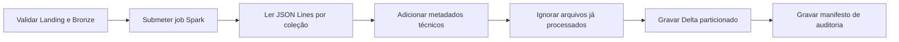

# DAG Landing → Bronze

Implementação da **Issue #16**, responsável por converter os arquivos MongoDB
Extended JSON Lines da Landing em tabelas Delta Lake na Bronze.

## Fluxo



## Arquivos

| Arquivo | Responsabilidade |
|---|---|
| `dags/landing_to_bronze.py` | Orquestração pelo Airflow |
| `dags/lib/landing_bronze.py` | Contratos, caminhos, manifesto e configuração Spark |
| `spark_jobs/landing_to_bronze.py` | Conversão PySpark para Delta Lake |
| `requirements-airflow.txt` | Providers usados pelas DAGs |
| `requirements-spark.txt` | PySpark e Delta Lake |
| `tests/test_landing_bronze.py` | Testes unitários das regras puras |

## Compatibilidade

O projeto utiliza:

- Apache Spark `3.5.3`;
- Delta Lake `3.3.1`;
- Hadoop AWS `3.3.4`;
- provider Spark do Airflow `6.1.0`.

Delta Lake `3.3.1` foi construído sobre Spark `3.5.3`. Os pacotes JVM são
fornecidos ao `spark-submit`:

```text
io.delta:delta-spark_2.12:3.3.1
org.apache.hadoop:hadoop-aws:3.3.4
```

## Airflow

A DAG `landing_to_bronze` executa cinco minutos após a agenda padrão da Landing:

```text
Landing:  */15 * * * *
Bronze:   5-59/15 * * * *
```

O atraso reduz a disputa entre as DAGs. A conversão é idempotente e uma
execução posterior processa qualquer arquivo que ainda não estava disponível.

### Connection Spark

Cadastre a connection `spark_default`.

Para execução local no worker:

| Campo | Valor |
|---|---|
| Connection Id | `spark_default` |
| Connection Type | `Spark` |
| Host | `local[*]` |

O ambiente Airflow deve conter Java, `spark-submit`, os dois arquivos de
requirements e o diretório `spark_jobs/` montado em `/opt/airflow/spark_jobs`.

## Configuração

| Variável | Padrão |
|---|---|
| `SPARK_CONN_ID` | `spark_default` |
| `SPARK_S3_ENDPOINT` | `http://minio:9000` |
| `SPARK_LOG_LEVEL` | `WARN` |
| `LANDING_TO_BRONZE_APPLICATION` | `/opt/airflow/spark_jobs/landing_to_bronze.py` |
| `LANDING_TO_BRONZE_SCHEDULE` | `5-59/15 * * * *` |
| `SPARK_PACKAGES` | Delta `3.3.1` e Hadoop AWS `3.3.4` |

As credenciais S3/MinIO são fornecidas por variáveis de ambiente ou secrets
backend. Nenhuma credencial é versionada.

## Metadados Bronze

O job adiciona:

| Coluna | Descrição |
|---|---|
| `raw_document` | Documento MongoDB Extended JSON original |
| `_bronze_source_file` | Arquivo JSON de origem |
| `_bronze_extraction_date` | Partição de extração da Landing |
| `_bronze_landing_run_id` | Execução que gerou o JSON |
| `_bronze_airflow_run_id` | Execução da DAG Bronze |
| `_bronze_ingested_at` | Horário de processamento pelo Spark |
| `ingestion_date` | Partição física da tabela Delta |

O documento completo permanece em `raw_document` exatamente como MongoDB
Extended JSON. Isso evita perda de informação e conflitos de schema entre
arquivos. A abertura dos campos, limpeza e conversão para tipos corporativos
pertencem à Silver.

## Idempotência

Antes de gravar, o job lê `_bronze_source_file` da tabela Delta e realiza um
`left_anti join`. Assim, um arquivo da Landing já registrado não é processado
novamente.

Essa regra impede duplicação por nova execução do mesmo pipeline, mas preserva
documentos repetidos entre arquivos diferentes. A deduplicação por chave de
negócio pertence à Issue #17.

## Organização

```text
s3://datalake/
└── bronze/
    ├── ecommerce/
    │   └── <colecao>/
    │       ├── _delta_log/
    │       └── ingestion_date=AAAA-MM-DD/*.parquet
    └── _control/
        └── landing_to_bronze/
            └── ingestion_date=AAAA-MM-DD/
                └── run_id=<airflow_run_id>/
                    └── manifest.json
```

O manifesto registra arquivos lidos, linhas gravadas e resultado de cada
coleção.

## Validação

```bash
PYTHONPYCACHEPREFIX=/tmp/engenharia_dados_pycache \
  python3 -m unittest discover -s tests -v

airflow dags list-import-errors
airflow dags test landing_to_bronze 2026-06-13
```

O teste integrado pode usar a imagem oficial:

```bash
docker run --rm \
  -v "$PWD:/opt/project" \
  -w /opt/project \
  apache/spark:3.5.3-python3 \
  /opt/spark/bin/spark-submit \
  --packages "io.delta:delta-spark_2.12:3.3.1,org.apache.hadoop:hadoop-aws:3.3.4" \
  spark_jobs/landing_to_bronze.py ...
```

### Evidência do teste integrado

Teste executado em **13 de junho de 2026**, no fuso
`America/Sao_Paulo`, com Spark `3.5.3`, Delta Lake `3.3.1` e MinIO local:

| Execução | Arquivos novos | Linhas gravadas | Resultado |
|---|---:|---:|---|
| `manual__issue16_integrated_1` | 20 | 150.635 | 10 tabelas Delta criadas |
| `manual__issue16_integrated_2` | 0 | 0 | 10 coleções já processadas |

Foram confirmados `_delta_log` nas dez tabelas Bronze e dois manifestos em
`bronze/_control/landing_to_bronze/ingestion_date=2026-06-13/`. A segunda
execução comprova que os mesmos arquivos da Landing não são duplicados.

## Limites

Esta issue não instala o ambiente Docker do Airflow, responsabilidade das
Issues #14/#19, e não aplica regras de limpeza da Silver.
