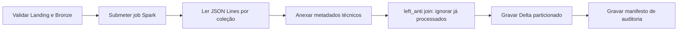

---
tags:
  - airflow
  - spark
  - delta-lake
  - bronze
  - idempotencia
---

# DAG Landing → Bronze

Implementação da **Issue #16**, responsável por converter os arquivos MongoDB
Extended JSON Lines da [Landing](dag_mongodb_landing.md) em tabelas **Delta
Lake** na camada Bronze. A DAG orquestra um job PySpark via
`SparkSubmitOperator`; o Airflow apenas valida e dispara, enquanto o Spark faz o
trabalho pesado de leitura, deduplicação por arquivo e escrita Delta.

!!! abstract "Em resumo"

    - A DAG `landing_to_bronze` roda **5 minutos depois** da Landing, em
      `5-59/15 * * * *`, para reduzir disputa entre os pipelines.
    - O Airflow valida o Data Lake e então submete um job Spark único que
      processa todas as coleções.
    - A Bronze **não abre os campos**: o documento original fica intacto em
      `raw_document`, e o job apenas anexa metadados técnicos de auditoria.
    - A idempotência é garantida por um `left_anti join` em `_bronze_source_file`:
      um arquivo da Landing já processado nunca é gravado de novo.
    - A tabela Delta é particionada por `ingestion_date`, e cada execução grava
      um manifesto de auditoria em `_control/`.

## Princípio da camada Bronze

A Bronze é a primeira camada estruturada do Medalhão, mas continua **fiel à
origem**. Em vez de explodir o JSON em colunas — o que criaria conflitos de
schema entre arquivos e arriscaria perda de informação — o job mantém o
documento inteiro em `raw_document` e adiciona apenas colunas técnicas. A
abertura dos campos, limpeza e conversão para tipos corporativos pertencem à
**Silver** (Issue #17).

## Fluxo



## Arquivos

| Arquivo | Responsabilidade |
|---|---|
| `dags/landing_to_bronze.py` | Orquestração pelo Airflow e submissão Spark |
| `dags/lib/landing_bronze.py` | Contratos, caminhos, manifesto e configuração Spark |
| `spark_jobs/landing_to_bronze.py` | Conversão PySpark para Delta Lake |
| `requirements-airflow.txt` | Providers usados pelas DAGs |
| `requirements-spark.txt` | PySpark e Delta Lake |
| `tests/test_landing_bronze.py` | Testes unitários das regras puras |

## Compatibilidade de versões

A combinação de versões abaixo não é arbitrária: Delta Lake `3.3.1` foi
construído sobre Spark `3.5.3`, e o `hadoop-aws` precisa casar com o Hadoop
embutido no Spark para que o conector S3A funcione.

- Apache Spark `3.5.3`;
- Delta Lake `3.3.1`;
- Hadoop AWS `3.3.4`;
- provider Spark do Airflow `6.1.0`.

Os pacotes JVM são fornecidos ao `spark-submit` via `--packages`:

```text
io.delta:delta-spark_2.12:3.3.1
org.apache.hadoop:hadoop-aws:3.3.4
```

Essa string é montada por `spark_packages()` em `dags/lib/landing_bronze.py`,
evitando versões soltas espalhadas pelo código.

## Agendamento e idempotência da DAG

A DAG `landing_to_bronze` executa cinco minutos após a agenda padrão da Landing:

```text
Landing:  */15 * * * *
Bronze:   5-59/15 * * * *
```

O atraso reduz a disputa entre as DAGs por recursos e dados em escrita. Como a
conversão é idempotente (ver [Idempotência](#idempotencia-por-arquivo)), uma
execução posterior simplesmente recupera qualquer arquivo que ainda não estava
disponível na rodada anterior — não há risco em rodar com folga.

### Connection Spark

Cadastre a connection `spark_default`. Para execução local no worker:

| Campo | Valor |
|---|---|
| Connection Id | `spark_default` |
| Connection Type | `Spark` |
| Host | `local[*]` |

O ambiente Airflow deve conter Java, `spark-submit`, os dois arquivos de
requirements e o diretório `spark_jobs/` montado em `/opt/airflow/spark_jobs`.

## Configuração

| Variável | Padrão |
|---|---|
| `SPARK_CONN_ID` | `spark_default` |
| `SPARK_S3_ENDPOINT` | `http://minio:9000` |
| `SPARK_LOG_LEVEL` | `WARN` |
| `LANDING_TO_BRONZE_APPLICATION` | `/opt/airflow/spark_jobs/landing_to_bronze.py` |
| `LANDING_TO_BRONZE_SCHEDULE` | `5-59/15 * * * *` |
| `SPARK_PACKAGES` | Delta `3.3.1` e Hadoop AWS `3.3.4` |

As credenciais S3/MinIO são fornecidas por variáveis de ambiente ou secrets
backend. Nenhuma credencial é versionada.

## Validação de pré-execução

A task `validate_data_lake` falha cedo se o ambiente não estiver pronto. Ela
confere três coisas, por coleção, antes de gastar recursos com Spark: o bucket
está acessível, existe o marcador `_READY` da estrutura Bronze, e há pelo menos
um arquivo `.json` na Landing.

```python title="dags/landing_to_bronze.py"
--8<-- "dags/landing_to_bronze.py:66:104"
```

## Submissão do job Spark

A orquestração em si é deliberadamente fina: uma validação seguida de um
`SparkSubmitOperator`. Toda a configuração Spark (extensões Delta, conector
S3A, credenciais) vem de `build_spark_conf`, e os argumentos do job são
passados por linha de comando, incluindo o `run_id` e a `logical_date` via
templates Jinja do Airflow.

```python title="dags/landing_to_bronze.py"
--8<-- "dags/landing_to_bronze.py:106:132"
```

A configuração do Spark para Delta + S3A fica isolada em `build_spark_conf`,
que ajusta automaticamente o uso de SSL conforme o esquema do endpoint:

```python title="dags/lib/landing_bronze.py"
--8<-- "dags/lib/landing_bronze.py:107:123"
```

## Processamento por coleção

O coração do pipeline é a função `process_collection` do job Spark. Para cada
coleção ela: lê recursivamente os `*.json` da Landing como texto, anexa os
metadados técnicos, descarta o que já foi processado e grava o restante em Delta
particionado por `ingestion_date`.

```python title="spark_jobs/landing_to_bronze.py"
--8<-- "spark_jobs/landing_to_bronze.py:58:150"
```

Alguns detalhes importantes desse trecho:

- A leitura usa `.text(...)` com `recursiveFileLookup` e `pathGlobFilter`, então
  cada **linha** do JSON Lines vira uma linha da tabela, sem parsear o conteúdo.
- Se o caminho da coleção ainda não existe (`PATH_NOT_FOUND`), a coleção é
  tratada como vazia em vez de falhar a execução inteira.
- `extraction_date` e o `run_id` da Landing são extraídos do **próprio caminho
  do arquivo** via `regexp_extract`, conectando a linhagem entre as camadas.
- A escrita usa `mergeSchema` e `partitionBy("ingestion_date")` em modo
  `append`.

## Metadados técnicos da Bronze

O job adiciona às linhas as seguintes colunas de auditoria, sem tocar no
conteúdo do documento:

| Coluna | Descrição |
|---|---|
| `raw_document` | Documento MongoDB Extended JSON original, intacto |
| `_bronze_source_file` | Arquivo JSON de origem (chave da idempotência) |
| `_bronze_extraction_date` | Partição de extração herdada da Landing |
| `_bronze_landing_run_id` | Execução da Landing que gerou o JSON |
| `_bronze_airflow_run_id` | Execução da DAG Bronze |
| `_bronze_ingested_at` | Horário de processamento pelo Spark |
| `ingestion_date` | Partição física da tabela Delta |

## Idempotência por arquivo

Antes de gravar, quando a tabela Delta já existe, o job lê os valores distintos
de `_bronze_source_file` já presentes e aplica um **`left_anti join`** contra os
dados novos. O resultado: apenas arquivos da Landing ainda não registrados são
escritos.

```python title="spark_jobs/landing_to_bronze.py"
--8<-- "spark_jobs/landing_to_bronze.py:111:124"
```

!!! info "Idempotência por arquivo, não por documento"

    Essa regra impede duplicação por **reexecução do mesmo pipeline** — rodar a
    DAG duas vezes não duplica nada. Ela **não** deduplica documentos repetidos
    que aparecem em arquivos diferentes (consequência esperada do overlap de 24h
    da Landing). A deduplicação por chave de negócio pertence à Issue #17.

## Manifesto de auditoria

Após todas as tabelas serem gravadas, `write_manifest` escreve um `manifest.json`
em `_control/`, resumindo a execução. A serialização é uma regra pura
(`build_manifest`), o que a torna testável sem Spark:

```python title="dags/lib/landing_bronze.py"
--8<-- "dags/lib/landing_bronze.py:61:91"
```

## Organização da saída

```text
s3://datalake/
└── bronze/
    ├── ecommerce/
    │   └── <colecao>/
    │       ├── _delta_log/
    │       └── ingestion_date=AAAA-MM-DD/*.parquet
    └── _control/
        └── landing_to_bronze/
            └── ingestion_date=AAAA-MM-DD/
                └── run_id=<airflow_run_id>/
                    └── manifest.json
```

O manifesto registra arquivos lidos, linhas gravadas e o status (`written`,
`already_processed` ou `no_landing_files`) de cada coleção.

## Validação

```bash
PYTHONPYCACHEPREFIX=/tmp/engenharia_dados_pycache \
  python3 -m unittest discover -s tests -v

airflow dags list-import-errors
airflow dags test landing_to_bronze 2026-06-13
```

O teste integrado pode usar a imagem oficial do Spark:

```bash
docker run --rm \
  -v "$PWD:/opt/project" \
  -w /opt/project \
  apache/spark:3.5.3-python3 \
  /opt/spark/bin/spark-submit \
  --packages "io.delta:delta-spark_2.12:3.3.1,org.apache.hadoop:hadoop-aws:3.3.4" \
  spark_jobs/landing_to_bronze.py ...
```

### Evidência do teste integrado

Teste executado em **13 de junho de 2026**, no fuso `America/Sao_Paulo`, com
Spark `3.5.3`, Delta Lake `3.3.1` e MinIO local:

| Execução | Arquivos novos | Linhas gravadas | Resultado |
|---|---:|---:|---|
| `manual__issue16_integrated_1` | 20 | 150.635 | 10 tabelas Delta criadas |
| `manual__issue16_integrated_2` | 0 | 0 | 10 coleções já processadas |

Foram confirmados `_delta_log` nas dez tabelas Bronze e dois manifestos em
`bronze/_control/landing_to_bronze/ingestion_date=2026-06-13/`. A segunda
execução comprova que os mesmos arquivos da Landing não são duplicados — a
prova prática da idempotência.

## Limites

Esta issue não instala o ambiente Docker do Airflow, responsabilidade das
Issues #14/#19, e não aplica regras de limpeza da Silver (Issue #17).

## Referências

- [Apache Spark](https://spark.apache.org/docs/latest/)
- [Delta Lake](https://docs.delta.io/latest/index.html)
- [SparkSubmitOperator](https://airflow.apache.org/docs/apache-airflow-providers-apache-spark/stable/operators.html)
- Página completa de [referências](referencias.md)
