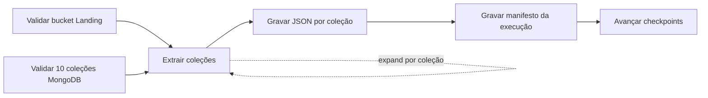

---
tags:
  - airflow
  - mongodb
  - landing
  - ingestao
  - incremental
---

# DAG MongoDB Atlas → Landing

Implementação da **Issue #15**, responsável por extrair as dez coleções da
origem MongoDB Atlas e gravá-las, sem transformação, na camada **Landing** do
Data Lake. Esta é a primeira etapa do pipeline Medalhão: a Landing guarda o
dado mais cru possível, exatamente como veio da origem, para servir de fonte
audível e reprocessável para a Bronze.

!!! abstract "Em resumo"

    - A DAG `mongodb_to_landing` roda a cada 15 minutos e faz **carga
      incremental** por coleção, usando o campo `updated_at` como checkpoint.
    - Cada coleção vira uma **task mapeada** independente, com falha, duração e
      contagem de registros isoladas.
    - Os documentos são gravados em **MongoDB Extended JSON Canonical**, uma
      linha por documento, preservando todos os tipos BSON.
    - O caminho de saída é particionado por `extraction_date` e `run_id`,
      tornando cada execução **imutável e idempotente**.
    - Os checkpoints (Airflow Variables) só avançam **depois** que todos os
      arquivos e o manifesto de auditoria foram gravados com sucesso.

## Objetivo e princípios

A camada Landing tem uma regra de ouro: **não transformar**. O papel da DAG é
copiar fielmente o que existe na origem para o Data Lake, de forma que:

- nenhuma informação seja perdida na conversão (tipos BSON preservados);
- qualquer execução possa ser repetida sem corromper o histórico;
- falhas em uma coleção não bloqueiem nem invalidem as demais.



A DAG é definida com o decorator `@dag` do TaskFlow API. Repare no `schedule`,
no `max_active_runs=1` (evita execuções concorrentes que disputariam a mesma
janela) e na política de `retries`:

```python title="dags/mongodb_to_landing.py"
--8<-- "dags/mongodb_to_landing.py:49:62"
```

A montagem das dependências entre tasks fica no final da função. A extração usa
`.expand(...)` para criar **uma task por coleção** dinamicamente:

```python title="dags/mongodb_to_landing.py"
--8<-- "dags/mongodb_to_landing.py:203:207"
```

## Arquivos da entrega

| Arquivo | Responsabilidade |
|---|---|
| `dags/mongodb_to_landing.py` | Definição da DAG e integração com MongoDB/S3 |
| `dags/lib/mongodb_landing.py` | Regras testáveis de checkpoint, caminhos e serialização |
| `pyproject.toml` (grupo `[airflow]`) | Providers MongoDB e Amazon/S3 |
| `tests/test_mongodb_landing.py` | Testes unitários da lógica de ingestão |

!!! tip "Por que separar a lógica em `lib/`?"

    Toda a regra pura — montar o filtro incremental, calcular caminhos, parsear
    checkpoints e serializar documentos — fica em `dags/lib/mongodb_landing.py`,
    sem depender de Airflow, MongoDB ou S3. Isso permite testá-la com
    `unittest` puro, sem subir nenhum serviço, e mantém a DAG enxuta como
    camada de orquestração.

## Dependências

Os providers são instalados na imagem customizada do Airflow pelo
`Dockerfile.airflow`, respeitando o arquivo de constraints da versão adotada:

```bash
docker compose build airflow-apiserver
```

O arquivo `pyproject.toml` (grupo `[airflow]`) registra os providers necessários:

- `apache-airflow-providers-mongo`
- `apache-airflow-providers-amazon`

O passo a passo do ambiente local está em
[`docs/ambiente_airflow.md`](ambiente_airflow.md).

## Connections do Airflow

As credenciais não ficam no Git. Devem ser cadastradas em **Admin →
Connections** ou fornecidas por um secrets backend.

=== "MongoDB Atlas"

    | Campo | Valor |
    |---|---|
    | Connection Id | `mongodb_atlas` |
    | Connection Type | `MongoDB` |
    | Host | host do cluster Atlas, sem `mongodb+srv://` |
    | Schema | `ecommerce` |
    | Login / Password | usuário e senha do Atlas |
    | Extra | `{"srv": true, "ssl": true, "authSource": "admin", "retryWrites": true, "w": "majority"}` |

=== "MinIO ou Amazon S3"

    | Campo | Valor |
    |---|---|
    | Connection Id | `minio_s3` |
    | Connection Type | `Amazon Web Services` |
    | AWS Access Key ID | access key do MinIO/S3 |
    | AWS Secret Access Key | secret key do MinIO/S3 |
    | Extra no MinIO | `{"endpoint_url": "http://minio:9000", "region_name": "us-east-1"}` |

!!! warning "Teste de Connection AWS contra MinIO"

    O botão de teste da Connection AWS pode falhar contra o MinIO porque ele não
    implementa a API STS usada por esse teste. A validação efetiva da DAG não
    depende disso: a task `validate_landing_bucket` usa `check_for_bucket`
    (`head_bucket`) por meio do `S3Hook`, que funciona normalmente.

## Configuração

Todos os parâmetros vêm de variáveis de ambiente, com padrões documentados no
`.env.example`. Os defaults são lidos no topo do módulo da DAG.

| Variável | Padrão | Uso |
|---|---|---|
| `MONGO_CONN_ID` | `mongodb_atlas` | Connection da origem |
| `S3_CONN_ID` | `minio_s3` | Connection do object storage |
| `LANDING_BUCKET` | `datalake` | Bucket previamente criado |
| `MONGO_DATABASE` | `ecommerce` | Banco da origem |
| `MONGO_COLLECTIONS` | dez coleções do modelo | Coleções obrigatórias |
| `MONGO_INCREMENTAL_FIELD` | `updated_at` | Campo de checkpoint |
| `MONGO_BATCH_SIZE` | `1000` | Tamanho do lote do cursor MongoDB |
| `MONGO_CHECKPOINT_OVERLAP_HOURS` | `24` | Janela de releitura (overlap) |
| `MONGO_TO_LANDING_SCHEDULE` | `*/15 * * * *` | Frequência da DAG |

As dez coleções padrão (`clientes`, `categorias`, `fornecedores`, `produtos`,
`cupons`, `pedidos`, `itens_pedido`, `pagamentos`, `entregas`, `avaliacoes`)
são definidas em `DEFAULT_COLLECTIONS` e validadas por `parse_collections`, que
rejeita listas vazias ou com nomes duplicados.

## Validações de pré-execução

Antes de extrair qualquer documento, a DAG roda duas tasks de guarda em
paralelo. Elas implementam o princípio de **falhar cedo**: se o destino não
existe ou a origem está incompleta, nada é gravado.

- `validate_landing_bucket`: confirma que o bucket da Landing existe via
  `S3Hook.check_for_bucket`. A criação do Data Lake é responsabilidade da
  Issue #10 — esta DAG apenas pressupõe a estrutura.
- `validate_source_collections`: lista as coleções do banco de origem e
  garante que **todas** as dez esperadas estão presentes, abortando com a lista
  exata das que faltam.

## Carga incremental por checkpoint

O coração da DAG está na task `extract_collection`. Ela é executada uma vez por
coleção e segue sempre o mesmo roteiro: lê o checkpoint atual, monta o filtro
incremental, transmite o cursor para um arquivo temporário e só então faz o
upload.

```python title="dags/mongodb_to_landing.py"
--8<-- "dags/mongodb_to_landing.py:90:172"
```

### Como o checkpoint funciona

Na **primeira execução** não existe checkpoint, então o filtro é vazio (`{}`) e
a coleção é lida integralmente. Nas execuções seguintes, o checkpoint
armazenado (o maior `updated_at` já visto) é usado para buscar apenas o que
mudou. A função pura que constrói o filtro deixa essa lógica explícita:

```python title="dags/lib/mongodb_landing.py"
--8<-- "dags/lib/mongodb_landing.py:62:74"
```

### Por que existe um overlap de 24 horas

O filtro não usa o checkpoint exato, e sim `checkpoint − 24h`
(`MONGO_CHECKPOINT_OVERLAP_HOURS`). Essa janela de sobreposição protege contra
dois problemas reais:

- **Empates de timestamp**: vários documentos com o mesmo `updated_at` no limite
  da janela poderiam ser cortados ao meio entre duas execuções.
- **Chegada atrasada (late arriving)**: registros gravados na origem com um
  `updated_at` ligeiramente no passado seriam perdidos por uma janela justa.

!!! info "O overlap gera duplicatas — e tudo bem"

    Reler 24h de dados produz documentos repetidos entre execuções. Isso é
    **esperado e aceito** na Landing e na Bronze histórica: o objetivo dessas
    camadas é não perder nada. A deduplicação por chave de negócio é
    responsabilidade da camada **Silver**.

### Onde o checkpoint é guardado

Cada coleção tem sua própria Airflow Variable, nomeada por
`checkpoint_variable_name(database, collection)`:

```text
mongodb_landing_checkpoint__ecommerce_<colecao>
```

O valor é o maior `updated_at` da extração, serializado em ISO-8601 UTC
(`format_checkpoint`). Crucialmente, **os checkpoints só avançam no final**, na
task `write_run_manifest`, depois que o manifesto foi gravado. Se qualquer
extração falhar, os checkpoints permanecem onde estavam e uma nova tentativa
relê exatamente a mesma janela, sem comprometer o snapshot já gravado.

## Streaming e formato dos arquivos

O cursor do MongoDB é lido em lotes (`batch_size`) e transmitido linha a linha
para um arquivo temporário, **sem carregar a coleção inteira na memória**. Cada
documento é escrito em uma linha no formato **MongoDB Extended JSON Canonical**,
que preserva tipos BSON como inteiros, decimais, datas e `ObjectId` — algo que
o JSON comum perderia.

```python title="dags/lib/mongodb_landing.py"
--8<-- "dags/lib/mongodb_landing.py:110:136"
```

Repare que `write_json_lines` também acompanha o maior `updated_at` visto
(`max_updated_at`): é esse valor que vira o próximo checkpoint. O upload para o
object storage só acontece se houver pelo menos um documento — coleções sem
novidades não geram arquivo.

## Particionamento e organização da saída

O caminho de cada arquivo é determinístico, calculado por `build_data_key`:

```python title="dags/lib/mongodb_landing.py"
--8<-- "dags/lib/mongodb_landing.py:85:97"
```

Particionar por `extraction_date` e `run_id` é o que garante **imutabilidade**:
cada execução escreve em um caminho único. Repetir o mesmo `run_id` sobrescreve
exatamente o mesmo objeto (`replace=True`), tornando a execução idempotente sem
duplicar arquivos.

```text
s3://datalake/
└── landing/
    ├── ecommerce/
    │   ├── clientes/
    │   │   └── extraction_date=2026-06-13/
    │   │       └── run_id=scheduled__.../
    │   │           └── part-00000.json
    │   └── pedidos/
    │       └── ...
    └── _control/
        └── mongodb_to_landing/
            └── extraction_date=2026-06-13/
                └── run_id=scheduled__.../
                    └── manifest.json
```

## Manifesto de auditoria

Depois que todas as coleções terminam, a task `write_run_manifest` grava um
`manifest.json` em `_control/` e só então avança os checkpoints. O manifesto é a
prova auditável da execução: registra a contagem total de documentos, o detalhe
por coleção e os checkpoints antes/depois.

```python title="dags/lib/mongodb_landing.py"
--8<-- "dags/lib/mongodb_landing.py:139:160"
```

| Campo do manifesto | Significado |
|---|---|
| `dag_id` / `run_id` | Identificam a execução |
| `logical_date` | Data lógica do Airflow, em UTC |
| `source.database` | Banco de origem (`ecommerce`) |
| `format` | `mongodb_extended_json_canonical_lines` |
| `total_documents` | Soma de documentos de todas as coleções |
| `collections[]` | Por coleção: contagem, objeto gerado e checkpoints |

## Validação

Testes unitários (regras puras, sem serviços externos):

```bash
PYTHONPYCACHEPREFIX=/tmp/engenharia_dados_pycache \
  python3 -m unittest discover -s tests -v
```

Validação no ambiente Airflow:

```bash
airflow dags list-import-errors
airflow dags test mongodb_to_landing 2026-06-13
```

??? note "Evidências para anexar à PR"

    1. DAG sem erros em `airflow dags list-import-errors`.
    2. Grid da DAG com as dez extrações concluídas.
    3. Objetos JSON das dez coleções no bucket.
    4. `manifest.json` com `total_documents`.
    5. Airflow Variables com um checkpoint por coleção.
    6. Segunda execução demonstrando carga incremental.

## Limites desta issue

A DAG pressupõe que o bucket e a estrutura da Landing já existam. A criação do
Data Lake pertence à Issue #10; a infraestrutura Docker do Airflow pertence às
issues de ambiente atribuídas aos demais integrantes. A conversão da Landing
para a Bronze é tratada na [Issue #16](dag_landing_bronze.md).

## Referências

- [Apache Airflow](https://airflow.apache.org/docs/)
- [Dynamic Task Mapping (`expand`)](https://airflow.apache.org/docs/apache-airflow/stable/authoring-and-scheduling/dynamic-task-mapping.html)
- [MongoDB Extended JSON](https://www.mongodb.com/docs/manual/reference/mongodb-extended-json/)
- Página completa de [referências](referencias.md)
