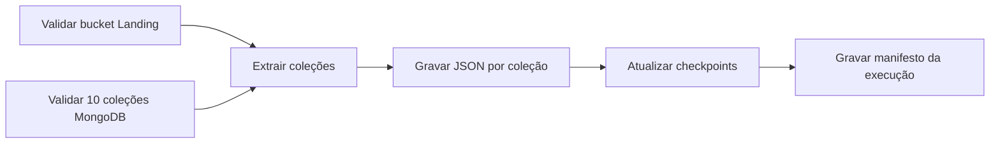

# DAG MongoDB Atlas → Landing

Implementação da **Issue #15**, responsável por extrair as dez coleções da
origem MongoDB Atlas e gravá-las na camada Landing do Data Lake.

## Objetivo

A DAG `mongodb_to_landing` executa a ingestão sem transformar os documentos da
origem. Cada coleção é processada por uma task mapeada do Airflow, permitindo
acompanhar falhas, duração e quantidade de registros individualmente.



## Arquivos da entrega

| Arquivo | Responsabilidade |
|---|---|
| `dags/mongodb_to_landing.py` | Definição da DAG e integração com MongoDB/S3 |
| `dags/lib/mongodb_landing.py` | Regras testáveis de checkpoint, caminhos e serialização |
| `requirements-airflow.txt` | Providers MongoDB e Amazon/S3 |
| `tests/test_mongodb_landing.py` | Testes unitários da lógica de ingestão |

## Dependências

Os providers devem ser instalados na mesma imagem/ambiente do Airflow,
respeitando o arquivo de constraints da versão adotada:

```bash
pip install -r requirements-airflow.txt
```

Versões registradas no projeto:

- `apache-airflow-providers-mongo==5.4.0`
- `apache-airflow-providers-amazon==9.29.0`

## Connections do Airflow

As credenciais não ficam no Git. Devem ser cadastradas em **Admin →
Connections** ou fornecidas por um secrets backend.

### MongoDB Atlas

| Campo | Valor |
|---|---|
| Connection Id | `mongodb_atlas` |
| Connection Type | `MongoDB` |
| Host | host do cluster Atlas, sem `mongodb+srv://` |
| Schema | `ecommerce` |
| Login / Password | usuário e senha do Atlas |
| Extra | `{"srv": true, "ssl": true, "authSource": "admin", "retryWrites": true, "w": "majority"}` |

### MinIO ou Amazon S3

| Campo | Valor |
|---|---|
| Connection Id | `minio_s3` |
| Connection Type | `Amazon Web Services` |
| AWS Access Key ID | access key do MinIO/S3 |
| AWS Secret Access Key | secret key do MinIO/S3 |
| Extra no MinIO | `{"endpoint_url": "http://minio:9000", "region_name": "us-east-1"}` |

O teste de Connection AWS da interface pode falhar contra MinIO porque ele não
implementa a API STS usada pelo teste. A validação efetiva da DAG usa
`head_bucket` por meio do `S3Hook`.

## Configuração

Os valores padrão estão documentados no `.env.example`.

| Variável | Padrão | Uso |
|---|---|---|
| `MONGO_CONN_ID` | `mongodb_atlas` | Connection da origem |
| `S3_CONN_ID` | `minio_s3` | Connection do object storage |
| `LANDING_BUCKET` | `datalake` | Bucket previamente criado |
| `MONGO_DATABASE` | `ecommerce` | Banco da origem |
| `MONGO_COLLECTIONS` | dez coleções do modelo | Coleções obrigatórias |
| `MONGO_INCREMENTAL_FIELD` | `updated_at` | Campo de checkpoint |
| `MONGO_BATCH_SIZE` | `1000` | Tamanho do lote do cursor |
| `MONGO_CHECKPOINT_OVERLAP_HOURS` | `24` | Janela de releitura |
| `MONGO_TO_LANDING_SCHEDULE` | `*/15 * * * *` | Frequência da DAG |

## Carga incremental

Na primeira execução não existe checkpoint e cada coleção é lida integralmente.
Após o upload bem-sucedido, a DAG salva uma Airflow Variable por coleção:

```text
mongodb_landing_checkpoint__ecommerce_<colecao>
```

Nas execuções seguintes, a consulta usa:

```javascript
{ "updated_at": { "$gte": checkpoint - janela_de_sobreposicao } }
```

A sobreposição evita perda de documentos quando vários registros possuem o
mesmo `updated_at` ou quando chegam atrasados. Ela pode gerar duplicatas entre
execuções, o que é esperado na Landing; a camada Bronze será responsável pela
deduplicação.

Os checkpoints só avançam depois que os arquivos de todas as coleções e o
manifesto são enviados ao object storage. Se qualquer extração falhar, uma nova
tentativa relê a mesma janela sem comprometer o snapshot já gravado.

## Formato e organização

Cada documento é escrito em uma linha no formato **MongoDB Extended JSON
Canonical**, preservando tipos BSON como inteiros, decimais, datas e `ObjectId`.

```text
s3://datalake/
└── landing/
    ├── ecommerce/
    │   ├── clientes/
    │   │   └── extraction_date=2026-06-13/
    │   │       └── run_id=scheduled__.../
    │   │           └── part-00000.json
    │   └── pedidos/
    │       └── ...
    └── _control/
        └── mongodb_to_landing/
            └── extraction_date=2026-06-13/
                └── run_id=scheduled__.../
                    └── manifest.json
```

O manifesto registra o total de documentos, os objetos gerados e os
checkpoints anterior e posterior de cada coleção. Uma nova tentativa do mesmo
`run_id` substitui o mesmo objeto, tornando a execução idempotente.

## Validação

Testes unitários:

```bash
PYTHONPYCACHEPREFIX=/tmp/engenharia_dados_pycache \
  python3 -m unittest discover -s tests -v
```

Validação no ambiente Airflow:

```bash
airflow dags list-import-errors
airflow dags test mongodb_to_landing 2026-06-13
```

Evidências para anexar à PR:

1. DAG sem erros em `airflow dags list-import-errors`.
2. Grid da DAG com as dez extrações concluídas.
3. Objetos JSON das dez coleções no bucket.
4. `manifest.json` com `total_documents`.
5. Airflow Variables com um checkpoint por coleção.
6. Segunda execução demonstrando carga incremental.

## Limites desta issue

A DAG pressupõe que o bucket e a estrutura da Landing já existam. A criação do
Data Lake pertence à Issue #10; a infraestrutura Docker do Airflow pertence às
issues de ambiente atribuídas aos demais integrantes.
