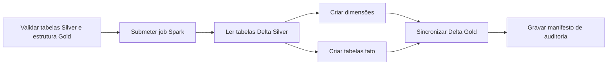

# DAG Silver → Gold

Implementação da **Issue #18**, responsável por transformar as tabelas
corporativas da Silver em um modelo dimensional otimizado para análise no
Power BI ou Apache Superset.

## Fluxo



## Arquivos

| Arquivo | Responsabilidade |
|---|---|
| `dags/silver_to_gold.py` | Orquestração pelo Airflow |
| `dags/lib/silver_gold.py` | Contrato, ordem, caminhos e manifesto |
| `spark_jobs/silver_to_gold.py` | Modelagem dimensional e `MERGE` PySpark |
| `tests/test_silver_gold.py` | Testes unitários do contrato |

## Agendamento

As quatro DAGs ficam separadas por cinco minutos:

```text
MongoDB → Landing:  */15 * * * *
Landing → Bronze:   5-59/15 * * * *
Bronze → Silver:    10-59/15 * * * *
Silver → Gold:      15-59/15 * * * *
```

## Configuração

| Variável | Padrão |
|---|---|
| `SPARK_CONN_ID` | `spark_default` |
| `S3_CONN_ID` | `minio_s3` |
| `SPARK_S3_ENDPOINT` | `http://minio:9000` |
| `GOLD_TABLES` | Quatro dimensões e quatro fatos |
| `SILVER_TO_GOLD_APPLICATION` | `/opt/airflow/spark_jobs/silver_to_gold.py` |
| `SILVER_TO_GOLD_SCHEDULE` | `15-59/15 * * * *` |

Antes de submeter o job, a DAG confirma:

- acesso ao bucket do Data Lake;
- existência do `_delta_log` de cada tabela Silver necessária;
- existência do marcador `_READY` de cada modelo Gold.

## Modelo dimensional

### Dimensões

| Tabela | Chave | Conteúdo |
|---|---|---|
| `dim_tempo` | `data_key` | Calendário diário do menor ao maior evento |
| `dim_cliente` | `cliente_key` | Perfil, cidade, estado e cadastro |
| `dim_produto` | `produto_key` | Produto enriquecido com categoria e fornecedor |
| `dim_cupom` | `cupom_key` | Código, percentual, mínimo, validade e situação |

A dimensão de tempo inclui ano, semestre, trimestre, mês, semana, dia da
semana e indicador de fim de semana. A dimensão de cliente não leva CPF,
e-mail, telefone ou endereço detalhado para a camada analítica.

### Tabelas fato

| Tabela | Granularidade | Principais medidas |
|---|---|---|
| `fato_vendas` | Um item de pedido | quantidade, valor bruto, desconto e receita líquida |
| `fato_pagamentos` | Um pagamento | valor, valor aprovado, parcelas e quantidade |
| `fato_entregas` | Uma entrega | prazos, atraso, entrega no prazo e quantidade |
| `fato_avaliacoes` | Uma avaliação | nota, avaliação positiva e quantidade |

As quatro tabelas fato são particionadas por `ano`. As dimensões permanecem
sem partições para evitar arquivos pequenos.

## Indicadores suportados

O modelo permite calcular diretamente:

- receita bruta e líquida;
- valor e percentual de desconto;
- itens vendidos, pedidos distintos e ticket médio;
- receita por período, cliente, produto, marca, categoria e fornecedor;
- valor aprovado por forma e situação de pagamento;
- prazo médio, dias de atraso e percentual de entregas no prazo;
- nota média e percentual de avaliações positivas.

## Sincronização e idempotência

Cada tabela recebe um hash dos campos de negócio. Quando a tabela ainda não
existe, o job cria o Delta Lake; nas execuções seguintes:

- insere chaves novas;
- atualiza somente registros cujo conteúdo mudou;
- remove chaves que deixaram de existir na Silver;
- não executa `MERGE` quando o modelo já está atualizado.

Metadados adicionados:

| Coluna | Descrição |
|---|---|
| `_gold_record_hash` | Hash dos campos analíticos |
| `_gold_airflow_run_id` | Execução que gravou a versão atual |
| `_gold_processed_at` | Horário de processamento |

## Auditoria

Cada execução grava:

```text
gold/_control/silver_to_gold/
└── processing_date=AAAA-MM-DD/
    └── run_id=<airflow_run_id>/
        └── manifest.json
```

O manifesto informa registros modelados, inseridos, atualizados, removidos,
inalterados e efetivamente gravados por tabela.

## Evidência do teste integrado

Teste executado em **13 de junho de 2026**, no fuso
`America/Sao_Paulo`, com Spark `3.5.3`, Delta Lake `3.3.1` e MinIO local:

| Modelo | Registros na primeira execução |
|---|---:|
| `dim_tempo` | 1.826 |
| `dim_cliente` | 15.000 |
| `dim_produto` | 15.000 |
| `dim_cupom` | 15.000 |
| `fato_vendas` | 15.000 |
| `fato_pagamentos` | 15.000 |
| `fato_entregas` | 15.000 |
| `fato_avaliacoes` | 15.000 |
| **Total** | **106.826** |

A execução `manual__issue18_integrated_1` criou as oito tabelas Delta Gold.
A repetição `manual__issue18_integrated_2` confirmou que os 106.826 registros
já estavam atualizados, sem novas inserções, atualizações ou remoções.

## Validação

```bash
PYTHONPYCACHEPREFIX=/tmp/engenharia_dados_pycache \
  python3 -m unittest discover -s tests -v

airflow dags list-import-errors
airflow dags test silver_to_gold 2026-06-13
```

## Limites

Esta issue materializa o modelo analítico Gold. A criação e publicação dos
dashboards no Power BI ou Superset pertencem à etapa de visualização.

## Referências

- [Kimball — Slowly Changing Dimensions](https://www.kimballgroup.com/2008/08/slowly-changing-dimensions-part-2/)
- [Delta Lake](https://docs.delta.io/latest/index.html)
- Página completa de [referências](referencias.md)
