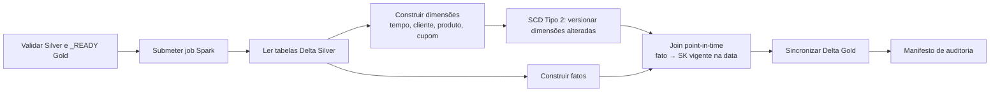

---
tags:
  - silver
  - gold
  - spark
  - delta
  - bi
  - scd2
---

# DAG Silver → Gold

Implementação da **Issue #18**. Esta etapa transforma as tabelas corporativas da
Silver em um **modelo dimensional** (esquema estrela) otimizado para análise no
Power BI ou Apache Superset. O diferencial é o tratamento de **histórico**: as
dimensões de negócio são carregadas como **SCD Tipo 2**, preservando cada versão
de um cliente, produto ou cupom ao longo do tempo, enquanto os fatos referenciam
a versão correta na data do evento.

!!! abstract "Em resumo"
    - **Por quê:** BI precisa de um modelo simples (fatos × dimensões) e de
      *histórico fiel* — saber, por exemplo, em que cidade o cliente morava na
      data da compra, mesmo que ele tenha se mudado depois.
    - **Como:** um job PySpark monta dimensões e fatos a partir da Silver,
      versiona as dimensões com SCD Tipo 2 (*staged merge* do Delta, sem
      `DELETE`) e liga cada fato à *surrogate key* vigente na data do evento
      (join *point-in-time*).
    - **Garantias:** idempotência (dimensões só ganham versão quando um atributo
      muda; fatos só são reescritos quando o conteúdo muda), fatos particionados
      por ano e auditoria por manifesto com `versions_expired`/`versions_inserted`.

## Fluxo



## Arquivos

| Arquivo | Responsabilidade |
|---|---|
| `dags/silver_to_gold.py` | Orquestração pelo Airflow (validação + `SparkSubmitOperator`) |
| `dags/lib/silver_gold.py` | Contrato dos modelos, ordem, caminhos e manifesto |
| `spark_jobs/silver_to_gold.py` | Modelagem dimensional, SCD2 e `MERGE` PySpark |
| `tests/test_silver_gold.py` | Testes unitários do contrato |
| `tests/test_scd2_gold_spark.py` | Teste de integração do SCD2 com PySpark + Delta |

## Orquestração no Airflow

A guarda `validate_data_lake` confere o bucket, o `_delta_log` de cada Silver
**realmente necessária** (deduzida das `source_tables` dos modelos selecionados)
e o marcador `_READY` de cada modelo Gold antes de submeter o job:

```python title="dags/silver_to_gold.py"
--8<-- "dags/silver_to_gold.py:72:108"
```

A DAG roda com `max_active_runs=1` e `retries=2`.

## Agendamento

As quatro DAGs ficam separadas por cinco minutos para que a Gold sempre leia uma
Silver atualizada:

```text
MongoDB → Landing:  */15 * * * *
Landing → Bronze:   5-59/15 * * * *
Bronze → Silver:    10-59/15 * * * *
Silver → Gold:      15-59/15 * * * *
```

## Configuração

| Variável | Padrão |
|---|---|
| `SPARK_CONN_ID` | `spark_default` |
| `S3_CONN_ID` | `minio_s3` |
| `SPARK_S3_ENDPOINT` | `http://minio:9000` |
| `GOLD_TABLES` | Quatro dimensões e quatro fatos |
| `SILVER_TO_GOLD_APPLICATION` | `/opt/airflow/spark_jobs/silver_to_gold.py` |
| `SILVER_TO_GOLD_SCHEDULE` | `15-59/15 * * * *` |

## Contrato dos modelos

Cada modelo Gold é descrito por um `GoldModelRule` em `dags/lib/silver_gold.py`:
chave primária, tipo (`dimension`/`fact`), tabelas Silver de origem, colunas de
partição e — para dimensões — o `scd_type` (`type2`, `static` ou `none`), a
chave natural e a *surrogate key*:

```python title="dags/lib/silver_gold.py"
--8<-- "dags/lib/silver_gold.py:56:108"
```

A função `parse_gold_models` restaura a **ordem dimensional** das seleções: as
dimensões SCD2 são processadas antes dos fatos, porque o join *point-in-time* dos
fatos precisa ler as versões já materializadas das dimensões.

## Modelo dimensional

### Dimensões

| Tabela | Tipo | Chave natural | Chave (PK) | Conteúdo |
|---|---|---|---|---|
| `dim_tempo` | estática | `data_key` | `data_key` | Calendário diário do menor ao maior evento |
| `dim_cliente` | **SCD Tipo 2** | `cliente_key` | `cliente_sk` | Perfil, cidade, estado e cadastro |
| `dim_produto` | **SCD Tipo 2** | `produto_key` | `produto_sk` | Produto enriquecido com categoria e fornecedor |
| `dim_cupom` | **SCD Tipo 2** | `cupom_key` | `cupom_sk` | Código, percentual, mínimo, validade e situação |

A `dim_tempo` é gerada por `sequence` entre a menor e a maior data observada em
todas as tabelas com data de negócio, e inclui ano, semestre, trimestre, mês
(número e nome em português), semana, dia da semana e indicador de fim de
semana. Ela é **estática**: um calendário não tem atributos que mudam, então não
precisa de versionamento.

A `dim_cliente` propositalmente **não leva** CPF, e-mail, telefone ou endereço
detalhado para a camada analítica — apenas o necessário para análise (perfil,
cidade, estado, cadastro):

```python title="spark_jobs/silver_to_gold.py"
--8<-- "spark_jobs/silver_to_gold.py:152:163"
```

A `dim_produto` é **enriquecida**: junta `produtos` com `categorias` e
`fornecedores` para que o fato de vendas possa filtrar por marca, categoria ou
fornecedor sem joins adicionais.

### Tabelas fato

| Tabela | Granularidade | Principais medidas |
|---|---|---|
| `fato_vendas` | Um item de pedido | quantidade, valor bruto, desconto e receita líquida |
| `fato_pagamentos` | Um pagamento | valor, valor aprovado, parcelas e quantidade |
| `fato_entregas` | Uma entrega | prazos, atraso, entrega no prazo e quantidade |
| `fato_avaliacoes` | Uma avaliação | nota, avaliação positiva e quantidade |

As quatro tabelas fato são **particionadas por `ano`**: as consultas de BI quase
sempre filtram por período, então o particionamento por ano elimina leitura de
dados irrelevantes (*partition pruning*). As dimensões, por serem pequenas,
permanecem sem partições para não gerar arquivos minúsculos.

## SCD Tipo 2 (histórico de versões)

As dimensões `dim_cliente`, `dim_produto` e `dim_cupom` são carregadas como
**SCD Tipo 2**: cada alteração de um atributo versionado **gera uma nova versão**
e preserva a anterior, em vez de sobrescrever. Isso é o que permite responder
"como esse cliente estava na data da compra".

As colunas de controle e os valores-sentinela ficam centralizados no contrato:

```python title="dags/lib/silver_gold.py"
--8<-- "dags/lib/silver_gold.py:39:53"
```

| Coluna | Descrição |
|---|---|
| `<dim>_sk` | *Surrogate key* — chave única **por versão** (PK da dimensão) |
| `<dim>_key` | Chave natural/durável de negócio (estável entre versões) |
| `dw_valid_from` / `dw_valid_to` | Vigência da versão |
| `dw_is_current` | Marca a versão corrente |
| `dw_record_hash` | Hash dos atributos versionados (detecta mudança) |

A *surrogate key* é **determinística**: hash da chave natural + o instante de
início de vigência. Isso garante unicidade por versão e reprodutibilidade (a
mesma versão sempre recebe a mesma SK):

```python title="spark_jobs/silver_to_gold.py"
--8<-- "spark_jobs/silver_to_gold.py:417:428"
```

### Ciclo de vida de uma versão

- **Carga inicial:** cada chave entra com `dw_valid_from = 1900-01-01`
  (`SCD2_BEGINNING_OF_TIME`, "desde sempre", para que fatos históricos casem com
  a primeira versão), `dw_valid_to = 9999-12-31` e `dw_is_current = true`.
- **Mudança de atributo:** a versão vigente é **expirada** (`dw_valid_to` recebe
  o instante da carga e `dw_is_current = false`) e uma **nova versão vigente** é
  inserida. **Nunca há `DELETE`** numa dimensão SCD2 — o histórico é imutável.
- **Sem mudança:** nenhuma escrita (idempotência).

A detecção de mudança compara o `dw_record_hash` da versão vigente com o hash da
linha vinda da Silver. O job classifica cada chave como `new`, `changed` ou
`unchanged` e executa a expiração + inserção em uma **única transação** Delta
(*staged merge*): um `merge` recebe um `staged` com dois tipos de linha — um
*payload de inserção* (`_merge_key = NULL`, vira nova versão) e um *payload de
expiração* (`_merge_key = chave natural`, casa com a versão vigente e a fecha):

```python title="spark_jobs/silver_to_gold.py"
--8<-- "spark_jobs/silver_to_gold.py:533:669"
```

!!! note "Por que o truque do `_merge_key`"
    O `MERGE` do Delta casa fonte e destino por uma condição. Para, na mesma
    transação, **fechar a versão antiga** e **inserir a nova**, o job emite duas
    linhas por chave alterada: a de expiração tem `_merge_key` = chave natural
    (então casa com a corrente e dispara o `whenMatchedUpdate` que seta
    `dw_valid_to` e `dw_is_current = false`); a de inserção tem `_merge_key`
    nulo (não casa, então cai no `whenNotMatchedInsert`). É o padrão *staged
    merge* recomendado pela Databricks para SCD2.

### Fatos: join *point-in-time*

Cada fato liga-se à **surrogate key vigente na data do evento**, não à versão
mais recente. O mapeamento de qual dimensão anexar e qual data usar fica
declarado em `FACT_DIMENSION_LINKS`:

```python title="spark_jobs/silver_to_gold.py"
--8<-- "spark_jobs/silver_to_gold.py:356:368"
```

O join compara a chave natural e exige que a data do evento caia dentro do
intervalo de vigência da versão (`dw_valid_from <= evento < dw_valid_to`):

```python title="spark_jobs/silver_to_gold.py"
--8<-- "spark_jobs/silver_to_gold.py:435:453"
```

Os fatos também mantêm a chave natural, permitindo rastreio e joins alternativos.

## Indicadores suportados

O modelo permite calcular diretamente:

- receita bruta e líquida;
- valor e percentual de desconto;
- itens vendidos, pedidos distintos e ticket médio;
- receita por período, cliente, produto, marca, categoria e fornecedor;
- valor aprovado por forma e situação de pagamento;
- prazo médio, dias de atraso e percentual de entregas no prazo;
- nota média e percentual de avaliações positivas.

## Sincronização e idempotência

**Dimensões SCD Tipo 2** (`dim_cliente`, `dim_produto`, `dim_cupom`): comparam o
`dw_record_hash` da versão vigente; chaves novas e alteradas inserem uma nova
versão, chaves alteradas expiram a anterior, e o histórico é preservado (sem
`DELETE`).

**Modelos Tipo 1** (`dim_tempo` e as quatro fato): comparam um hash dos campos de
negócio e, nas execuções seguintes, inserem chaves novas, atualizam apenas o que
mudou, removem chaves que sumiram da Silver (`whenNotMatchedBySourceDelete`) e
não executam `MERGE` quando já estão atualizados:

```python title="spark_jobs/silver_to_gold.py"
--8<-- "spark_jobs/silver_to_gold.py:456:530"
```

Metadados adicionados (modelos Tipo 1):

| Coluna | Descrição |
|---|---|
| `_gold_record_hash` | Hash dos campos analíticos |
| `_gold_airflow_run_id` | Execução que gravou a versão atual |
| `_gold_processed_at` | Horário de processamento |

## Métricas e auditoria

O manifesto agrega, por tabela e no total, registros modelados, inseridos,
atualizados, removidos, inalterados e gravados. Para as dimensões SCD2, inclui
`versions_expired` (versões fechadas) e `versions_inserted` (versões abertas):

```python title="dags/lib/silver_gold.py"
--8<-- "dags/lib/silver_gold.py:198:235"
```

O manifesto fica em:

```text
gold/_control/silver_to_gold/
└── processing_date=AAAA-MM-DD/
    └── run_id=<airflow_run_id>/
        └── manifest.json
```

## Evidência do teste integrado

Teste executado em **13 de junho de 2026**, no fuso `America/Sao_Paulo`, com
Spark `3.5.3`, Delta Lake `3.3.1` e MinIO local:

| Modelo | Registros na primeira execução |
|---|---:|
| `dim_tempo` | 1.826 |
| `dim_cliente` | 15.000 |
| `dim_produto` | 15.000 |
| `dim_cupom` | 15.000 |
| `fato_vendas` | 15.000 |
| `fato_pagamentos` | 15.000 |
| `fato_entregas` | 15.000 |
| `fato_avaliacoes` | 15.000 |
| **Total** | **106.826** |

A execução `manual__issue18_integrated_1` criou as oito tabelas Delta Gold. A
repetição `manual__issue18_integrated_2` confirmou que os 106.826 registros já
estavam atualizados, sem novas inserções, atualizações ou remoções.

## Validação

```bash
PYTHONPYCACHEPREFIX=/tmp/engenharia_dados_pycache \
  python3 -m unittest discover -s tests -v

airflow dags list-import-errors
airflow dags test silver_to_gold 2026-06-13
```

O comportamento do SCD Tipo 2 (carga inicial, expiração/nova versão e join
*point-in-time*) é coberto por um teste de integração com PySpark + Delta em
`tests/test_scd2_gold_spark.py`. Ele roda apenas onde o PySpark está disponível
(ex.: um venv com Python 3.13) e é pulado automaticamente na suíte padrão:

```bash
python3.13 -m venv .venv-spark
.venv-spark/bin/pip install pyspark==3.5.3 delta-spark==3.3.1
.venv-spark/bin/python -m unittest tests.test_scd2_gold_spark
```

## Limites

Esta issue materializa o modelo analítico Gold. A criação e publicação dos
dashboards no Power BI ou Superset pertencem à etapa de visualização.

## Referências

- [Kimball — Slowly Changing Dimensions (Tipo 2)](https://www.kimballgroup.com/2008/08/slowly-changing-dimensions-part-2/)
- [Databricks — *staged merge* / SCD Tipo 2 com Delta](https://docs.databricks.com/aws/en/delta/merge)
- [Delta Lake — `MERGE`](https://docs.delta.io/latest/delta-update.html)
- Página completa de [referências](referencias.md)
