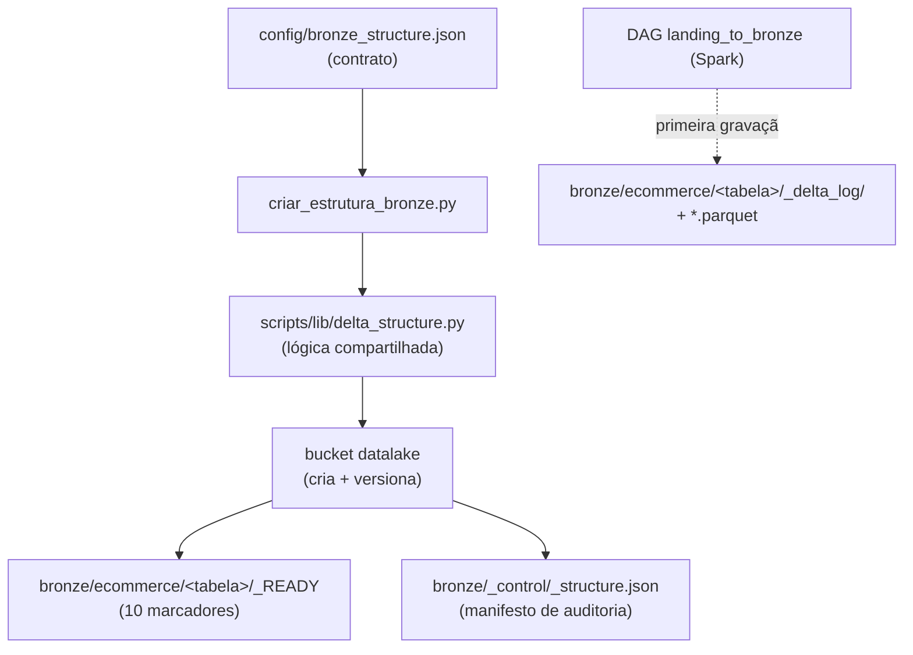

---
tags:
  - bronze
  - delta lake
  - object storage
---

# Estrutura da camada Bronze

A camada **Bronze** é a primeira camada **Delta Lake** do data lake. Ela recebe
os dados que vieram da [Landing](estrutura_landing.md) e os organiza como tabelas
versionadas, preservando a granularidade dos documentos e acrescentando
**histórico** e **metadados técnicos** de ingestão. Esta página explica **o que**
a estrutura prepara, **por que** ela é desenhada assim e **como** reproduzi-la em
MinIO ou Amazon S3.

A implementação corresponde à **Issue #11**.

!!! abstract "Em resumo"
    - A Bronze materializa os prefixos de dez **tabelas Delta**, descritas por um
      contrato versionado (`config/bronze_structure.json`).
    - A lógica é compartilhada por `scripts/lib/delta_structure.py`, reutilizada
      também pela Silver e Gold.
    - O marcador `_READY` apenas **reserva o prefixo**; a tabela Delta de fato
      (com `_delta_log/`) só nasce quando a DAG Landing → Bronze grava.
    - O manifesto de controle registra particionamento e a **origem** dos dados;
      `--validate-only` confere a estrutura **e** detecta um manifesto divergente.

## Papel da camada

A Bronze é a fronteira entre o dado bruto e o dado consultável. Ela não limpa nem
deduplica — isso é papel da Silver —, mas dá ao dado bruto uma forma tabular,
transacional e auditável:

| Aspecto | Decisão na Bronze | Porquê |
|---|---|---|
| Formato | Delta Lake (Parquet + `_delta_log`) | Dá transações ACID, time travel e leitura colunar eficiente |
| Granularidade | Mesma da Landing (um registro por documento) | Permite rastrear cada documento de origem até a tabela |
| Particionamento | `ingestion_date` | Isola cada janela de ingestão e acelera filtros por data |
| Metadados | Colunas técnicas de auditoria | Registram quando e de onde cada linha foi ingerida |

!!! info "Landing × Bronze"
    A **[Landing](estrutura_landing.md)** guarda o JSON bruto. A **Bronze** é a
    primeira tabela Delta, já preparada para o Spark. Manter as duas separadas
    garante que sempre exista a cópia fiel da origem antes da conversão.

## Contrato versionado

O arquivo `config/bronze_structure.json` é a **fonte de verdade** da estrutura.
Além das tabelas, ele declara as colunas de particionamento:

```json title="config/bronze_structure.json"
--8<-- "config/bronze_structure.json"
```

| Campo | Significado |
|---|---|
| `bucket` | Bucket S3/MinIO onde tudo é gravado (`datalake`) |
| `database` | Nome lógico do banco, usado como prefixo (`ecommerce`) |
| `layer` | Camada do medalhão (`bronze`), prefixo de primeiro nível |
| `tables` | As dez tabelas Delta, alinhadas às coleções da Landing |
| `partition_columns` | Colunas de partição física (`ingestion_date`) |

O carregador valida o contrato com regras mais rígidas que a Landing: além de
exigir todos os campos e rejeitar duplicatas, ele **força os nomes** a usarem
apenas letras minúsculas, números e `_` (padrão seguro para tabelas Delta) e
confere que a camada declarada é mesmo `bronze`:

```python title="scripts/lib/delta_structure.py — load_delta_config"
--8<-- "scripts/lib/delta_structure.py:37:76"
```

Os testes garantem que as tabelas permaneçam alinhadas às dez coleções
processadas pela DAG MongoDB → Landing.

!!! note "Lógica compartilhada entre camadas"
    O script `criar_estrutura_bronze.py` é fino: ele só carrega o contrato e
    delega para `scripts/lib/delta_structure.py`. As mesmas funções servem
    Bronze, Silver e Gold — muda apenas o JSON de entrada. Isso evita duplicar
    código e garante que todas as camadas Delta se comportem de forma idêntica.

## Como os prefixos são derivados

Assim como na Landing, os caminhos são **derivados** do contrato por funções
puras. A Bronze acrescenta um conceito específico de Delta: o prefixo do
`_delta_log/`, que é onde o log de transações da tabela viverá:

```python title="scripts/lib/delta_structure.py — derivação de caminhos"
--8<-- "scripts/lib/delta_structure.py:79:96"
```

## Estrutura criada

Object storages não têm diretórios reais. Cada prefixo de tabela é materializado
por um objeto vazio `_READY`, e o manifesto de controle descreve a camada
inteira:



```text
s3://datalake/
└── bronze/
    ├── ecommerce/
    │   ├── clientes/_READY
    │   ├── categorias/_READY
    │   ├── fornecedores/_READY
    │   ├── produtos/_READY
    │   ├── cupons/_READY
    │   ├── pedidos/_READY
    │   ├── itens_pedido/_READY
    │   ├── pagamentos/_READY
    │   ├── entregas/_READY
    │   └── avaliacoes/_READY
    └── _control/
        └── _structure.json
```

### O manifesto de controle

O manifesto da Bronze é mais rico que o da Landing: além de prefixos e formato,
ele registra o **caminho esperado do `_delta_log`**, as **colunas de partição** e
a **origem** (camada e formato de onde os dados vêm). Isso documenta o contrato
de transformação entre Landing e Bronze:

```python title="scripts/lib/delta_structure.py — build_structure_manifest"
--8<-- "scripts/lib/delta_structure.py:99:125"
```

## Delta Lake: por que `_READY` não é uma tabela

O marcador `_READY` apenas materializa o prefixo no object storage. Ele **não**
simula uma tabela Delta e **não** cria um log de transações vazio.

A tabela passa a existir como Delta Lake somente quando a DAG Landing → Bronze
realiza a primeira gravação com Apache Spark e cria:

```text
bronze/ecommerce/<tabela>/_delta_log/
bronze/ecommerce/<tabela>/ingestion_date=AAAA-MM-DD/*.parquet
```

!!! tip "Por que essa separação importa"
    Criar um `_delta_log` vazio agora produziria uma tabela **sem esquema**, que
    o Spark trataria de forma imprevisível. Reservar só o prefixo deixa a criação
    física — com o esquema correto inferido dos dados — inteiramente na conversão
    da Issue #16.

## Inicialização

Com o MinIO ativo e as variáveis do `.env` exportadas:

```bash
docker compose up -d minio

python3 -m venv .venv
source .venv/bin/activate
pip install ".[infra]"

set -a
source .env
set +a

python scripts/criar_estrutura_bronze.py
```

Resultado esperado:

```text
Estrutura criada/atualizada: 10 tabelas em s3://datalake/bronze/
Marcadores criados: 10; manifesto atualizado: sim
Estrutura Bronze valida: s3://datalake/bronze/
```

### Por que é idempotente

O comando pode ser executado novamente sem duplicar objetos ou criar novas
versões quando o contrato não mudou. A inicialização verifica cada marcador antes
de criá-lo e só regrava o manifesto quando seu conteúdo muda — a comparação
ignora o `generated_at`, então apenas mudanças reais no contrato geram nova
versão. Na segunda execução, a linha de auditoria informa
`Marcadores criados: 0; manifesto atualizado: nao`:

```python title="scripts/lib/delta_structure.py — initialize_delta_layer"
--8<-- "scripts/lib/delta_structure.py:128:190"
```

O versionamento do bucket é habilitado por padrão (use `--no-versioning` para
desligar), preservando o histórico do manifesto e de qualquer objeto sobrescrito.

## Validação

Para verificar a camada **sem criar ou modificar objetos**:

```bash
python scripts/criar_estrutura_bronze.py --validate-only
```

A validação da Bronze vai além da Landing: ela confere os dez marcadores e o
manifesto **e** compara o conteúdo do manifesto com o contrato atual. Um
manifesto presente mas **desatualizado** é reportado como `(divergente)`, não
apenas a ausência de objetos. Retorna código `0` quando tudo está de acordo e `1`
caso contrário:

```python title="scripts/lib/delta_structure.py — validate_delta_layer"
--8<-- "scripts/lib/delta_structure.py:193:230"
```

Testes automatizados:

```bash
PYTHONPYCACHEPREFIX=/tmp/engenharia_dados_pycache \
  python3 -m unittest discover -s tests -v
```

### Validação integrada local

Em 13 de junho de 2026, a estrutura foi criada e validada no MinIO local:

| Verificação | Resultado |
|---|---|
| Tabelas previstas | 10 |
| Marcadores `_READY` | 10 |
| Manifestos de controle | 1 |
| Objetos sob `bronze/` | 11 |
| Versões sob `bronze/` | 11 |
| Versionamento do bucket | `Enabled` |
| Segunda execução | 0 marcadores e 0 manifestos alterados |

A igualdade entre objetos e versões confirma que a segunda execução não gerou
novas versões. O modo `--validate-only` também confirmou que a estrutura e o
manifesto permanecem de acordo com o contrato versionado.

## Limites desta issue

Esta entrega prepara e valida o armazenamento da Bronze. A leitura da Landing,
a conversão com Apache Spark e a criação física das tabelas Delta pertencem à
Issue #16.

## Referências

- [Delta Lake](https://docs.delta.io/latest/index.html)
- [Delta Lake — Protocolo de transações (`_delta_log`)](https://github.com/delta-io/delta/blob/master/PROTOCOL.md)
- [Apache Spark — Documentação](https://spark.apache.org/docs/latest/)
- [MinIO — Versionamento de buckets](https://min.io/docs/minio/linux/administration/object-management/object-versioning.html)
- Página completa de [referências](referencias.md)
