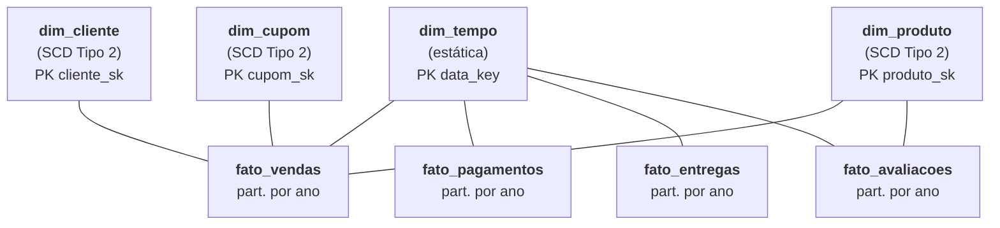
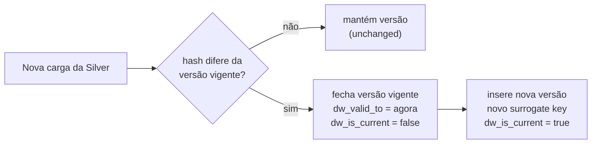

---
tags:
  - gold
  - medalhão
  - modelo dimensional
  - scd tipo 2
  - delta lake
---

# Estrutura da camada Gold

Implementação da **Issue #13**, responsável por preparar a camada **Gold** no
MinIO ou Amazon S3 para o **modelo dimensional** consumido pelas ferramentas de
BI. Esta página descreve o esquema estrela, as dimensões e fatos com suas
chaves, e *por que* três dimensões usam **SCD Tipo 2**.

!!! abstract "Em resumo"
    A Gold organiza os dados validados da Silver em um **esquema estrela**:
    **4 dimensões** (`dim_tempo`, `dim_cliente`, `dim_produto`, `dim_cupom`) e
    **4 fatos** (`fato_vendas`, `fato_pagamentos`, `fato_entregas`,
    `fato_avaliacoes`). As dimensões `dim_cliente`, `dim_produto` e `dim_cupom`
    são **versionadas com SCD Tipo 2** (preservam histórico); `dim_tempo` é
    **estática** (calendário). Os fatos são **particionados por `ano`**. Esta
    entrega provisiona o armazenamento (oito prefixos Delta, marcadores `_READY`,
    manifesto e validação idempotente); a carga é feita pela DAG `silver_to_gold`.

## :material-target: Objetivo

A Gold transforma a fonte corporativa da Silver em um modelo otimizado para
consultas analíticas em Power BI ou Apache Superset, voltado a **vendas,
pagamentos, logística e satisfação**. Esta entrega cria:

- contrato **versionado** do modelo analítico;
- quatro dimensões e quatro tabelas fato;
- marcadores ocultos `_READY`;
- manifesto de controle da camada;
- validação automatizada e inicialização **idempotente**.

## :material-star-four-points: Modelo dimensional (esquema estrela)

No esquema estrela, os **fatos** ficam no centro com as métricas de negócio e
referenciam as **dimensões** por chaves estrangeiras. Esse formato reduz o
número de joins e torna as consultas de BI rápidas e intuitivas.



O arquivo `config/gold_structure.json` define as oito tabelas:

```json title="config/gold_structure.json"
--8<-- "config/gold_structure.json"
```

!!! info "Por que `partition_columns` está vazio aqui?"
    O contrato de **estrutura** mantém a lista vazia porque o particionamento é
    decidido na **modelagem**, não no provisionamento. A DAG `silver_to_gold`
    mantém as dimensões **sem particionamento** (são pequenas e consultadas por
    inteiro) e particiona as quatro tabelas fato pela coluna **`ano`**, conforme
    declarado em `GOLD_MODELS`.

## :material-table-key: Dimensões e fatos com suas chaves

As regras de cada modelo — chave primária, tipo (`dimension`/`fact`), tabelas de
origem na Silver, particionamento e estratégia SCD — vivem em `GOLD_MODELS`,
dentro de `dags/lib/silver_gold.py`:

```python title="dags/lib/silver_gold.py — GOLD_MODELS"
--8<-- "dags/lib/silver_gold.py:71:133"
```

### Dimensões

| Dimensão | Chave primária | SCD | Origem (Silver) | Finalidade |
|---|---|---|---|---|
| `dim_tempo` | `data_key` | `static` | (derivada das datas dos fatos) | Calendário para análises temporais |
| `dim_cliente` | `cliente_sk` (surrogate) | `type2` | `clientes` | Perfil e localização dos clientes |
| `dim_produto` | `produto_sk` (surrogate) | `type2` | `produtos`, `categorias`, `fornecedores` | Produto + marca, categoria e fornecedor |
| `dim_cupom` | `cupom_sk` (surrogate) | `type2` | `cupons` | Campanhas e descontos |

!!! note "Categoria e fornecedor dentro da dimensão de produto"
    `dim_produto` **incorpora** categoria e fornecedor (denormalização típica de
    esquema estrela). Isso simplifica o consumo no BI e evita exigir múltiplos
    joins para as análises mais comuns. A junção das três tabelas Silver é feita
    pela [DAG Silver → Gold](dag_silver_gold.md).

### Fatos

| Fato | Chave de negócio | Partição | Origem (Silver) | Finalidade |
|---|---|---|---|---|
| `fato_vendas` | `venda_key` | `ano` | `itens_pedido`, `pedidos` | Pedidos, itens, quantidade, desconto e receita |
| `fato_pagamentos` | `pagamento_key` | `ano` | `pagamentos`, `pedidos` | Valores, formas, status e parcelas |
| `fato_entregas` | `entrega_key` | `ano` | `entregas`, `pedidos` | Prazo, atraso, transportadora e status |
| `fato_avaliacoes` | `avaliacao_key` | `ano` | `avaliacoes` | Nota e volume de avaliações |

!!! tip "Por que particionar os fatos por `ano`?"
    Os fatos crescem indefinidamente, enquanto as dimensões são pequenas.
    Particionar por `ano` permite ao Spark **podar partições** (*partition
    pruning*) em consultas com filtro temporal, lendo apenas os anos relevantes
    em vez da tabela inteira.

## :material-history: SCD Tipo 2 nas dimensões versionadas

**SCD** (*Slowly Changing Dimension*) Tipo 2 preserva o **histórico** de
mudanças de um atributo. Em vez de sobrescrever, cada alteração relevante cria
uma **nova versão** da linha, mantendo as anteriores. Assim, um fato registrado
no passado continua apontando para o estado da dimensão **na época** do evento
(por exemplo, o estado do cliente no momento da compra, e não o estado atual).

As dimensões `dim_cliente`, `dim_produto` e `dim_cupom` usam SCD Tipo 2; isso é
exposto pelo helper `scd2_models()`. A `dim_tempo` é `static` (um calendário não
muda historicamente) e os fatos não têm SCD (`none`).

### Chaves: natural vs. substituta

Cada dimensão SCD Tipo 2 distingue duas chaves:

- **Chave natural / durável** (`natural_key`, ex.: `cliente_key`) — identifica o
  *negócio*, estável entre versões. Várias linhas podem compartilhá-la.
- **Chave substituta** (`surrogate_key`, ex.: `cliente_sk`) — única **por
  versão** e usada como **PK** da dimensão. É ela que os fatos referenciam, para
  apontar à versão correta no tempo.

### Colunas de controle do SCD Tipo 2

A versão de cada linha é controlada por quatro colunas técnicas (prefixo `dw_`),
definidas como constantes em `dags/lib/silver_gold.py`:

```python title="dags/lib/silver_gold.py — colunas de controle do SCD Tipo 2"
--8<-- "dags/lib/silver_gold.py:39:53"
```

| Coluna | Papel |
|---|---|
| `dw_valid_from` | Início da validade da versão. A primeira versão usa `1900-01-01` ("desde sempre"), para que **fatos históricos** casem com ela |
| `dw_valid_to` | Fim da validade. A versão **vigente** fica em aberto até `9999-12-31` |
| `dw_is_current` | Sinalizador booleano da versão atual (facilita filtrar "o estado de hoje") |
| `dw_record_hash` | *Hash* dos atributos de negócio; usado para **detectar mudança** e decidir quando abrir uma nova versão |



!!! info "Por que `1900` e `9999`?"
    As sentinelas `SCD2_BEGINNING_OF_TIME` e `SCD2_END_OF_TIME` evitam tratar
    nulos em joins por intervalo. Um fato com data qualquer sempre cai dentro de
    `[dw_valid_from, dw_valid_to)` de exatamente uma versão, sem casos especiais.

## :material-cog-play: Inicialização

Com o MinIO ativo e as variáveis do `.env` exportadas:

```bash
docker compose up -d minio

uv venv
source .venv/bin/activate
uv pip install ".[infra]"

set -a
source .env
set +a

python scripts/criar_estrutura_gold.py
```

=== "Primeira execução"

    ```text
    Estrutura criada/atualizada: 8 tabelas em s3://datalake/gold/
    Marcadores criados: 8; manifesto atualizado: sim
    Estrutura Gold valida: s3://datalake/gold/
    ```

=== "Segunda execução (idempotente)"

    ```text
    Estrutura criada/atualizada: 8 tabelas em s3://datalake/gold/
    Marcadores criados: 0; manifesto atualizado: nao
    Estrutura Gold valida: s3://datalake/gold/
    ```

## :material-folder-table: Estrutura criada

```text
s3://datalake/
└── gold/
    ├── ecommerce/
    │   ├── dim_tempo/_READY
    │   ├── dim_cliente/_READY
    │   ├── dim_produto/_READY
    │   ├── dim_cupom/_READY
    │   ├── fato_vendas/_READY
    │   ├── fato_pagamentos/_READY
    │   ├── fato_entregas/_READY
    │   └── fato_avaliacoes/_READY
    └── _control/
        └── _structure.json
```

Os marcadores reservam os prefixos, mas **não** criam tabelas Delta vazias. A
primeira gravação da DAG Silver → Gold cria os arquivos Parquet e o `_delta_log`
de cada modelo.

## :material-chart-box: Indicadores suportados

O modelo foi organizado para permitir, entre outros:

- receita, pedidos, itens vendidos e ticket médio;
- vendas por período, estado, produto, marca e categoria;
- desempenho de cupons e descontos;
- pagamentos por forma e status;
- prazo médio, atraso e desempenho por transportadora;
- nota média e avaliações por produto.

As medidas necessárias para esses indicadores são materializadas pela DAG
Silver → Gold e agregadas no consumo pelo Power BI ou Superset.

## :material-check-decagram: Validação

Para verificar a estrutura **sem modificar objetos**:

```bash
python scripts/criar_estrutura_gold.py --validate-only
```

A validação confirma o bucket, os **oito marcadores** `_READY` e o manifesto
`_structure.json` (que deve corresponder byte a byte ao contrato).

Testes automatizados:

```bash
PYTHONPYCACHEPREFIX=/tmp/engenharia_dados_pycache \
  python3 -m unittest discover -s tests -v
```

### Validação integrada local

Em 13 de junho de 2026, a estrutura foi criada e validada no MinIO local:

| Verificação | Resultado |
|---|---|
| Dimensões previstas | 4 |
| Tabelas fato previstas | 4 |
| Marcadores `_READY` | 8 |
| Manifestos de controle | 1 |
| Objetos sob `gold/` | 9 |
| Versões sob `gold/` | 9 |
| Versionamento do bucket | `Enabled` |
| Segunda execução | 0 marcadores e 0 manifestos alterados |

A igualdade entre objetos e versões confirma que a segunda execução **não gerou
novas versões**.

## :material-fence: Limites desta issue

Esta entrega **prepara e valida o armazenamento** da Gold. A implementação dos
joins, dimensões, fatos, SCD Tipo 2 e medidas de negócio está documentada
separadamente na [Issue #18](dag_silver_gold.md).

## Referências

- [Kimball — Dimensional Modeling](https://www.kimballgroup.com/data-warehouse-business-intelligence-resources/kimball-techniques/dimensional-modeling-techniques/)
- [Kimball — Type 2 Slowly Changing Dimension](https://www.kimballgroup.com/data-warehouse-business-intelligence-resources/kimball-techniques/dimensional-modeling-techniques/type-2/)
- [Delta Lake](https://docs.delta.io/latest/index.html)
- Página completa de [referências](referencias.md)
