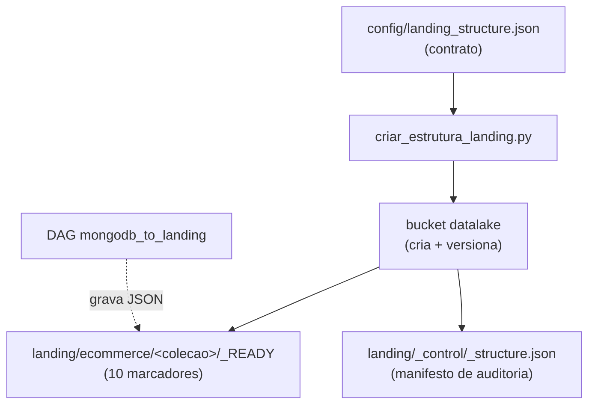

---
tags:
  - landing
  - minio
  - object storage
---

# Estrutura da camada Landing

A camada **Landing** é a porta de entrada do data lake: ela recebe os documentos
**brutos** extraídos do MongoDB, exatamente como vieram da origem, sem
transformação de esquema. Esta página descreve **o que** a estrutura cria no
object storage, **por que** ela é organizada dessa forma e **como** reproduzi-la
em MinIO local ou Amazon S3.

A implementação corresponde à **Issue #10**, atualizada para o domínio de
e-commerce do projeto. Os critérios antigos da issue (alunos e check-ins) não
correspondem ao modelo MongoDB atual.

!!! abstract "Em resumo"
    - A Landing guarda o JSON **bruto** de dez coleções do e-commerce, sem
      alterar tipos nem esquema.
    - A estrutura é descrita por um **contrato versionado**
      (`config/landing_structure.json`), que é a única fonte de verdade.
    - O script `scripts/criar_estrutura_landing.py` cria os prefixos de forma
      **idempotente** e grava um **manifesto de auditoria** em
      `landing/_control/_structure.json`.
    - `--validate-only` confere a estrutura **sem escrever nada**, retornando
      código `0` (válida) ou `1` (incompleta) — ideal para CI.

## Papel da camada

Na arquitetura medalhão, cada camada tem uma responsabilidade clara. A Landing
é a **zona de pouso** (landing zone):

| Aspecto | Decisão na Landing | Porquê |
|---|---|---|
| Formato | JSON (MongoDB Extended JSON canônico, uma linha por documento) | Preserva tipos do BSON (`$oid`, `$date`, `$numberDecimal`) sem perda |
| Transformação | Nenhuma | Mantém a fidelidade ao dado de origem; transformação é responsabilidade da Bronze/Silver |
| Granularidade | Um documento por linha | Permite reprocessar e auditar registro a registro |
| Histórico | Particionado por data de extração | Cada execução da DAG fica isolada e rastreável |

!!! info "Landing × Bronze"
    A **Landing** é o dado bruto em JSON. A **[Bronze](estrutura_bronze.md)** é
    a primeira tabela Delta Lake, já com colunas de auditoria. Separar as duas
    garante que sempre exista uma cópia fiel da origem antes de qualquer
    conversão.

## MinIO local

O serviço usa uma versão fixa da imagem para garantir reprodutibilidade — uma
imagem `latest` poderia mudar de comportamento entre execuções:

```text
minio/minio:RELEASE.2025-09-07T16-13-09Z
```

Suba somente o object storage:

```bash
cp .env.example .env
docker compose up -d minio
docker compose ps minio
```

Serviços disponíveis:

| Serviço | Endereço |
|---|---|
| API compatível com S3 | <http://localhost:9000> |
| Console administrativo | <http://localhost:9001> |
| Healthcheck | <http://localhost:9000/minio/health/live> |

!!! warning "Credenciais"
    As credenciais locais vêm de `MINIO_ROOT_USER` e `MINIO_ROOT_PASSWORD`. Os
    valores do `.env.example` servem **apenas** para desenvolvimento local e não
    devem ser usados em ambientes reais.

## Contrato versionado

O arquivo `config/landing_structure.json` é a **fonte de verdade** da estrutura.
Versioná-lo no Git garante que qualquer mudança na lista de coleções passe por
revisão e fique registrada no histórico:

```json title="config/landing_structure.json"
--8<-- "config/landing_structure.json"
```

| Campo | Significado |
|---|---|
| `bucket` | Bucket S3/MinIO onde tudo é gravado (`datalake`) |
| `database` | Nome lógico do banco de origem, usado como prefixo (`ecommerce`) |
| `layer` | Camada do medalhão (`landing`), prefixo de primeiro nível |
| `collections` | As dez coleções do e-commerce que viram prefixos |

O carregador valida o contrato antes de tocar no storage: exige todos os campos,
rejeita lista vazia, nomes duplicados ou nomes em branco. Isso evita criar uma
estrutura inconsistente por erro de digitação no JSON:

```python title="scripts/criar_estrutura_landing.py — load_config"
--8<-- "scripts/criar_estrutura_landing.py:49:70"
```

Os testes garantem que essa lista permaneça igual à lista padrão da DAG da
Issue #15, evitando divergência entre o que é extraído e o que tem prefixo.

## Como os prefixos são derivados

Os caminhos não são escritos à mão: são **derivados** do contrato por funções
puras, o que torna a estrutura previsível e testável. O prefixo de cada coleção
combina camada, banco e nome da coleção:

```python title="scripts/criar_estrutura_landing.py — derivação de caminhos"
--8<-- "scripts/criar_estrutura_landing.py:73:85"
```

## Estrutura criada

Object storages **não possuem diretórios reais** — só existem chaves de objeto.
Um prefixo como `landing/ecommerce/clientes/` só "aparece" quando há pelo menos
um objeto com aquele prefixo. Por isso o script materializa cada prefixo com um
objeto vazio chamado `_READY`, que funciona como um marcador "este caminho está
pronto para receber dados":



```text
s3://datalake/
└── landing/
    ├── ecommerce/
    │   ├── clientes/_READY
    │   ├── categorias/_READY
    │   ├── fornecedores/_READY
    │   ├── produtos/_READY
    │   ├── cupons/_READY
    │   ├── pedidos/_READY
    │   ├── itens_pedido/_READY
    │   ├── pagamentos/_READY
    │   ├── entregas/_READY
    │   └── avaliacoes/_READY
    └── _control/
        └── _structure.json
```

Os arquivos de dados da DAG são adicionados **abaixo desses mesmos prefixos**,
particionados por data de extração e por execução do Airflow:

```text
landing/ecommerce/<colecao>/extraction_date=AAAA-MM-DD/
  run_id=<airflow_run_id>/part-00000.json
```

### O manifesto de controle

O objeto `landing/_control/_structure.json` é gerado pelo próprio script e
descreve a estrutura esperada — coleções, prefixos, formato e data de geração.
Ele serve como **documento de auditoria** independente do código: qualquer
consumidor pode lê-lo para descobrir a estrutura sem precisar do repositório.

```python title="scripts/criar_estrutura_landing.py — build_structure_manifest"
--8<-- "scripts/criar_estrutura_landing.py:88:108"
```

## Inicialização

Instale a dependência do inicializador em um ambiente virtual:

```bash
python3 -m venv .venv
source .venv/bin/activate
pip install ".[infra]"
```

Exporte as variáveis do `.env` e execute:

```bash
set -a
source .env
set +a

python scripts/criar_estrutura_landing.py
```

Resultado esperado:

```text
Estrutura criada/atualizada: 10 colecoes em s3://datalake/landing/
Estrutura Landing valida: s3://datalake/landing/
```

### Por que é idempotente

O comando pode ser executado quantas vezes for preciso sem duplicar objetos nem
gerar versões desnecessárias. Antes de criar cada marcador, o script verifica se
ele já existe (`object_exists`); e o manifesto só é regravado quando seu conteúdo
muda — a comparação ignora o campo `generated_at` justamente para que apenas
mudanças **reais** no contrato gerem uma nova versão:

```python title="scripts/lib/object_storage.py — manifest_matches"
--8<-- "scripts/lib/object_storage.py:50:65"
```

### Versionamento do bucket

Por padrão o script habilita **versionamento** no bucket (`--no-versioning`
desliga). Com o versionamento ativo, cada sobrescrita preserva a versão anterior
do objeto — o que dá uma trilha de histórico para o manifesto e para qualquer
dado gravado. O bucket é criado apenas se ainda não existir:

```python title="scripts/lib/object_storage.py — ensure_bucket"
--8<-- "scripts/lib/object_storage.py:21:36"
```

## Validação

Para verificar a estrutura **sem criar ou modificar objetos**, use o modo
`--validate-only`. Ele é útil em pipelines de CI e como checagem rápida antes de
a DAG rodar:

```bash
python scripts/criar_estrutura_landing.py --validate-only
```

O comando confere o bucket e todos os marcadores obrigatórios mais o manifesto.
Retorna código `0` quando tudo existe e código `1` quando o bucket ou algum
marcador está ausente — listando exatamente o que falta:

```python title="scripts/criar_estrutura_landing.py — validate_landing"
--8<-- "scripts/criar_estrutura_landing.py:175:196"
```

Testes automatizados:

```bash
PYTHONPYCACHEPREFIX=/tmp/engenharia_dados_pycache \
  python3 -m unittest discover -s tests -v
```

### Validação integrada local

Em 13 de junho de 2026, a estrutura foi validada localmente com MongoDB 7,
MinIO e Apache Airflow 3.2.2:

| Execução | Arquivos JSON | Documentos | Resultado |
|---|---:|---:|---|
| Carga inicial | 10 | 150.000 | Sucesso |
| Carga incremental | 10 | 635 | Sucesso |

A carga inicial gravou 15.000 documentos de cada coleção e gerou um manifesto
com total de 150.000. A segunda execução leu somente a janela incremental de 24
horas, gerando 635 documentos, exatamente o volume previsto pela consulta na
origem.

Também foram confirmados:

- dez checkpoints no Airflow, um por coleção;
- dois manifestos de execução no MinIO;
- 150.000 linhas na carga inicial e 635 na incremental;
- MongoDB e MinIO com healthcheck saudável;
- checkpoints inalterados na segunda execução, pois a origem não recebeu novos
  registros entre as cargas.

## Amazon S3

O mesmo inicializador funciona no Amazon S3 usando a cadeia padrão de
credenciais do `boto3`. Para isso, **não defina** `S3_ENDPOINT_URL` e configure
as credenciais e a região da conta AWS. A omissão do endpoint faz o `boto3`
apontar para a AWS real em vez do MinIO local.

## Limites desta issue

Esta entrega cria e valida a estrutura de armazenamento. A extração MongoDB →
Landing pertence à Issue #15, e a conversão dos arquivos para Delta Lake na
Bronze pertence à Issue #16.

## Referências

- [MinIO — Documentação](https://min.io/docs/minio/linux/index.html)
- [Versionamento de buckets no MinIO](https://min.io/docs/minio/linux/administration/object-management/object-versioning.html)
- [MongoDB Extended JSON](https://www.mongodb.com/docs/manual/reference/mongodb-extended-json/)
- [boto3 — Credenciais](https://boto3.amazonaws.com/v1/documentation/api/latest/guide/credentials.html)
- Página completa de [referências](referencias.md)
