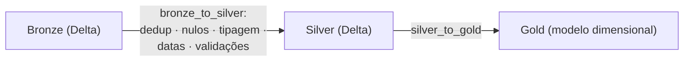

---
tags:
  - silver
  - medalhão
  - delta lake
  - qualidade de dados
---

# Estrutura da camada Silver

Implementação da **Issue #12**, responsável por preparar a camada **Silver** no
MinIO ou Amazon S3 para receber os dados **limpos, tipados e padronizados** do
e-commerce. Esta página descreve *o que* a estrutura cria, *por que* ela existe
no formato apresentado e *como* executá-la e validá-la.

!!! abstract "Em resumo"
    A Silver é a **fonte corporativa validada** do projeto. Ela mantém a mesma
    granularidade das entidades da Bronze (uma tabela por entidade de negócio),
    mas só recebe registros que passaram por **deduplicação, tratamento de
    nulos, tipagem forte e validações de qualidade**. Esta entrega **provisiona
    o armazenamento** — dez prefixos Delta no bucket `datalake`, marcadores
    `_READY`, um manifesto de controle auditável e validação idempotente. A
    *gravação física* das tabelas Delta fica a cargo da DAG `bronze_to_silver`.

## :material-target: Objetivo

A camada Silver fica entre a Bronze (ingestão fiel e bruta) e a Gold (modelo
dimensional para BI). Seu papel é entregar dados **confiáveis e estáveis** para
qualquer consumidor a jusante, sem ainda aplicar regras de modelagem analítica.

Esta entrega cria:

- contrato **versionado** das dez tabelas Silver;
- prefixos das tabelas no bucket `datalake`;
- marcadores ocultos `_READY` que materializam cada prefixo;
- manifesto de controle da camada (`_structure.json`);
- validação automatizada e inicialização **idempotente**;
- infraestrutura comum reutilizável pelas demais camadas Delta.

!!! info "Por que separar estrutura de carga?"
    Provisionar o armazenamento antes da carga torna a pipeline **previsível**:
    a DAG `bronze_to_silver` pode assumir que os prefixos e o contrato já
    existem, e a estrutura pode ser validada de forma independente (por exemplo,
    em CI) sem depender da execução do job Spark.

## :material-broom: O que a Silver garante (limpeza, tipagem e qualidade)

A *estrutura* aqui criada é apenas o "esqueleto" de armazenamento. As regras de
negócio que dão à Silver o seu valor são aplicadas pela DAG `bronze_to_silver`
no momento da gravação. Em alto nível, a transformação Bronze → Silver garante:

| Dimensão de qualidade | O que é feito | Por quê |
|---|---|---|
| **Deduplicação** | Remove registros repetidos por chave de negócio | Evita dupla contagem nos fatos da Gold |
| **Tratamento de nulos** | Padroniza ausências e descarta registros inválidos | Impede que nulos quebrem joins e agregações |
| **Tipagem forte** | Converte texto da Bronze em tipos corretos (datas, inteiros, decimais) | Permite cálculos e filtros confiáveis |
| **Formatação de datas** | Normaliza datas para um padrão único | Habilita o cruzamento com a `dim_tempo` da Gold |
| **Validações de qualidade** | Verifica integridade e domínios esperados | Falha cedo, antes de propagar dados ruins |

!!! tip "Onde isso é implementado"
    A lógica completa de deduplicação, tratamento de nulos, padronização de
    tipos, formatação de datas e validações está documentada em
    [`dag_bronze_silver.md`](dag_bronze_silver.md). Esta página cobre apenas a
    **estrutura de armazenamento** que aquela DAG consome.

## :material-file-document-outline: Contrato versionado

O arquivo `config/silver_structure.json` é a **fonte de verdade** da estrutura.
Ele é lido e validado por `load_delta_config`, que exige os campos `bucket`,
`database`, `layer`, `tables` e `partition_columns`, confirma que a `layer` é
exatamente `silver` e rejeita nomes de tabela inválidos (apenas letras
minúsculas, números e `_`) ou duplicados.

```json title="config/silver_structure.json"
--8<-- "config/silver_structure.json"
```

As dez tabelas permanecem alinhadas, uma a uma, às entidades da Bronze:

| Tabela | Entidade de negócio |
|---|---|
| `clientes` | Cadastro de clientes |
| `categorias` | Categorias de produtos |
| `fornecedores` | Fornecedores |
| `produtos` | Catálogo de produtos |
| `cupons` | Cupons e campanhas |
| `pedidos` | Cabeçalho dos pedidos |
| `itens_pedido` | Itens (linhas) de cada pedido |
| `pagamentos` | Pagamentos dos pedidos |
| `entregas` | Entregas / logística |
| `avaliacoes` | Avaliações de produtos |

!!! question "Por que `partition_columns` está vazio?"
    As tabelas têm **datas de negócio diferentes** entre si, então não faz
    sentido impor uma chave de particionamento global. A estratégia física de
    cada tabela é decidida pela DAG `bronze_to_silver`, conforme as regras de
    cada entidade. Deixar a lista vazia mantém o contrato neutro e evita
    particionamentos inadequados.

## :material-cog-play: Inicialização

Com o MinIO ativo e as variáveis do `.env` exportadas:

```bash
docker compose up -d minio

uv venv
source .venv/bin/activate
uv pip install ".[infra]"

set -a
source .env
set +a

python scripts/criar_estrutura_silver.py
```

=== "Primeira execução"

    ```text
    Estrutura criada/atualizada: 10 tabelas em s3://datalake/silver/
    Marcadores criados: 10; manifesto atualizado: sim
    Estrutura Silver valida: s3://datalake/silver/
    ```

=== "Segunda execução (idempotente)"

    ```text
    Estrutura criada/atualizada: 10 tabelas em s3://datalake/silver/
    Marcadores criados: 0; manifesto atualizado: nao
    Estrutura Silver valida: s3://datalake/silver/
    ```

!!! note "Idempotência"
    A função `initialize_delta_layer` só grava um marcador quando ele **ainda
    não existe** e só regrava o manifesto quando o conteúdo **diverge** do
    esperado. Por isso a segunda execução reporta `0` marcadores criados e
    manifesto não alterado — e, com versionamento habilitado, **não** gera novas
    versões de objeto.

## :material-folder-table: Estrutura criada

```text
s3://datalake/
└── silver/
    ├── ecommerce/
    │   ├── clientes/_READY
    │   ├── categorias/_READY
    │   ├── fornecedores/_READY
    │   ├── produtos/_READY
    │   ├── cupons/_READY
    │   ├── pedidos/_READY
    │   ├── itens_pedido/_READY
    │   ├── pagamentos/_READY
    │   ├── entregas/_READY
    │   └── avaliacoes/_READY
    └── _control/
        └── _structure.json
```

| Objeto | Papel |
|---|---|
| `silver/ecommerce/<tabela>/_READY` | Marcador oculto que **materializa o prefixo** da tabela em um object storage sem diretórios reais |
| `silver/_control/_structure.json` | **Manifesto auditável** com bucket, database, formato `delta`, origem `bronze`, prefixos e caminhos esperados de `_delta_log` |

??? example "Conteúdo do manifesto (`build_structure_manifest`)"
    O manifesto é gerado de forma determinística (`sort_keys=True`), o que
    permite comparar byte a byte na validação. Ele registra, para cada tabela,
    o `prefix` e o `delta_log_prefix` esperados, além da origem (`bronze` /
    `delta`) e o `control_prefix` da camada.

## :material-delta: Delta Lake

Os marcadores `_READY` **não** simulam tabelas Delta nem criam logs vazios. Eles
apenas reservam o caminho. A DAG `bronze_to_silver` cria o log transacional e os
arquivos de dados na **primeira gravação**:

```text
silver/ecommerce/<tabela>/_delta_log/
silver/ecommerce/<tabela>/*.parquet
```



## :material-check-decagram: Validação

Para verificar a estrutura **sem modificar objetos**:

```bash
python scripts/criar_estrutura_silver.py --validate-only
```

A validação (`validate_delta_layer`) retorna código `0` apenas quando:

- o bucket `datalake` existe;
- os **dez marcadores** `_READY` existem;
- o manifesto `_structure.json` existe **e** corresponde byte a byte ao contrato
  atual (caso contrário, é reportado como `divergente`).

Testes automatizados:

```bash
PYTHONPYCACHEPREFIX=/tmp/engenharia_dados_pycache \
  python3 -m unittest discover -s tests -v
```

### Validação integrada local

Em 13 de junho de 2026, a estrutura foi criada e validada no MinIO local:

| Verificação | Resultado |
|---|---|
| Tabelas previstas | 10 |
| Marcadores `_READY` | 10 |
| Manifestos de controle | 1 |
| Objetos sob `silver/` | 11 |
| Versões sob `silver/` | 11 |
| Versionamento do bucket | `Enabled` |
| Segunda execução | 0 marcadores e 0 manifestos alterados |

A igualdade entre objetos e versões confirma que a segunda execução **não gerou
novas versões**. A Bronze também foi validada novamente após a extração do
módulo compartilhado para estruturas Delta.

## :material-fence: Limites desta issue

Esta entrega **prepara e valida o armazenamento** da Silver. A leitura da
Bronze, as regras de qualidade e a gravação física das tabelas Delta são
implementadas separadamente pela Issue #17.

## Referências

- [Delta Lake — `MERGE`](https://docs.delta.io/latest/delta-update.html)
- [Delta Lake — visão geral](https://docs.delta.io/latest/index.html)
- [Apache Spark](https://spark.apache.org/docs/latest/)
- Página completa de [referências](referencias.md)
