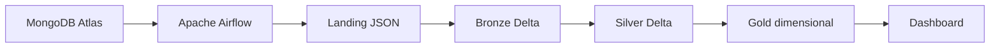

# Engenharia de Dados — Projeto Final

Este projeto implementa um pipeline de dados para um e-commerce fictício,
partindo de uma origem MongoDB e seguindo a arquitetura medalhão no Data Lake.

## Fluxo

## Conteúdo disponível

- [Modelo MongoDB](modelo_mongodb.md): coleções, tipos e relacionamentos.
- [MongoDB Atlas](mongodb_atlas.md): configuração da origem compartilhada.
- [Ambiente Airflow](ambiente_airflow.md): stack Docker local para orquestrar
  as DAGs.
- [Estrutura Landing](estrutura_landing.md): MinIO, bucket, prefixos e
  validação.
- [Estrutura Bronze](estrutura_bronze.md): contrato das tabelas Delta,
  prefixos e validação.
- [Estrutura Silver](estrutura_silver.md): contrato das tabelas limpas,
  prefixos e validação.
- [Estrutura Gold](estrutura_gold.md): dimensões, fatos, indicadores e
  validação.
- [DAG MongoDB → Landing](dag_mongodb_landing.md): ingestão incremental,
  checkpoints e formato dos arquivos.
- [DAG Landing → Bronze](dag_landing_bronze.md): conversão PySpark para Delta,
  idempotência e auditoria.
- [DAG Bronze → Silver](dag_bronze_silver.md): limpeza, tipagem, deduplicação,
  qualidade e `MERGE` Delta.
- [DAG Silver → Gold](dag_silver_gold.md): modelo dimensional, medidas de
  negócio e sincronização das tabelas analíticas.
