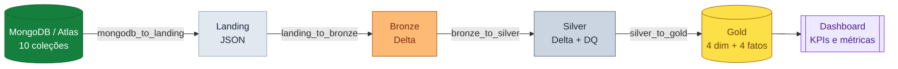

---
tags:
  - visão geral
  - medalhão
  - e-commerce
---

:material-database-arrow-right: Projeto Final · Arquitetura Medalhão

# Engenharia de Dados — E-commerce { .hero-title }

  Pipeline completo <strong>MongoDB → Landing → Bronze → Silver → Gold</strong>
  sobre um <strong>Data Lake</strong> em object storage (MinIO), orquestrado com
  <strong>Apache Airflow</strong>, transformado com <strong>Apache Spark</strong>
  em <strong>Delta Lake</strong> e entregue como modelo dimensional para o dashboard.

[:material-rocket-launch: Visão geral da arquitetura](arquitetura.md){ .md-button .md-button--primary }
[:material-database: Modelo da origem](modelo_mongodb.md){ .md-button }

---

## :material-layers-triple: Camadas do Data Lake

-   :material-database-arrow-down:{ .lg .middle } **Landing**

    ---

    Cópia bruta das 10 coleções do MongoDB em **JSON** (Extended JSON), sem
    transformação. Particionada por data de extração.

    [:octicons-arrow-right-24: Camada Landing](estrutura_landing.md)

-   :material-layers-plus:{ .lg .middle } **Bronze**

    ---

    Conversão dos JSON para **Delta Lake** com metadados de auditoria e
    idempotência por arquivo de origem.

    [:octicons-arrow-right-24: Camada Bronze](estrutura_bronze.md)

-   :material-shield-check:{ .lg .middle } **Silver**

    ---

    **Data Quality**: deduplicação, tipagem, validações (CPF, CNPJ, enums) e
    integridade referencial via `MERGE` incremental.

    [:octicons-arrow-right-24: Camada Silver](estrutura_silver.md)

-   :material-star-four-points:{ .lg .middle } **Gold**

    ---

    Modelo dimensional: **4 dimensões + 4 fatos**. Dimensões em **SCD Tipo 2**;
    fatos particionados por ano.

    [:octicons-arrow-right-24: Camada Gold](estrutura_gold.md)

---

## :material-transit-connection-variant: Como funciona o pipeline

Quatro DAGs do Airflow movem os dados entre as camadas, agendadas em sequência e
com carga incremental por `updated_at`:

| # | DAG | Movimento |
|---|-----|-----------|
| 1 | `mongodb_to_landing` | MongoDB → Landing (JSON) |
| 2 | `landing_to_bronze` | Landing → Bronze (Delta) |
| 3 | `bronze_to_silver` | Bronze → Silver (DQ + validações) |
| 4 | `silver_to_gold` | Silver → Gold (dimensional, SCD2) |

---

## :material-cube-outline: Stack tecnológico

-   :simple-mongodb:{ .lg .middle } **MongoDB / Atlas**

    ---

    Origem NoSQL com 10 coleções de e-commerce, geradas com Faker e
    compartilhadas no Atlas.

-   :simple-apacheairflow:{ .lg .middle } **Apache Airflow**

    ---

    Orquestração e agendamento das quatro DAGs do medalhão.

-   :simple-apachespark:{ .lg .middle } **Apache Spark + Delta**

    ---

    Transformações distribuídas (PySpark) gravando em Delta Lake nas camadas
    Bronze, Silver e Gold.

-   :simple-minio:{ .lg .middle } **MinIO (S3)**

    ---

    Object storage compatível com S3 que hospeda o Data Lake local.

---

## :material-bookshelf: Por onde começar

-   :material-map-outline:{ .lg .middle } **Arquitetura**

    ---

    Visão geral da solução, diagrama de fluxo e decisões de design.

    [:octicons-arrow-right-24: Ver arquitetura](arquitetura.md)

-   :material-database:{ .lg .middle } **Modelo da origem**

    ---

    Dicionário das 10 coleções, relacionamentos e estratégia incremental.

    [:octicons-arrow-right-24: Modelo MongoDB](modelo_mongodb.md)

-   :material-cloud-outline:{ .lg .middle } **MongoDB Atlas**

    ---

    Como criar o cluster compartilhado e carregar os dados.

    [:octicons-arrow-right-24: Setup Atlas](mongodb_atlas.md)

-   :material-table-star:{ .lg .middle } **Modelo dimensional (Gold)**

    ---

    Dimensões, fatos, SCD Tipo 2 e particionamento.

    [:octicons-arrow-right-24: DAG Silver → Gold](dag_silver_gold.md)

---

## :material-information-outline: Sobre o projeto

!!! abstract "Contexto acadêmico"
    Projeto final de Engenharia de Dados: um pipeline completo que parte de uma
    origem **não-relacional** (MongoDB), percorre a arquitetura **Medalhão** em um
    Data Lake e entrega um modelo dimensional pronto para análise.

**Domínio:** e-commerce · **10 coleções** · **4 dimensões + 4 fatos** ·
**Repositório:** [:fontawesome-brands-github: olucasoliverio/Engenharia_Dados_Final](https://github.com/olucasoliverio/Engenharia_Dados_Final)

## Referências

- [Documentação do MongoDB](https://www.mongodb.com/docs/)
- [Apache Airflow](https://airflow.apache.org/docs/)
- [Apache Spark](https://spark.apache.org/docs/latest/)
- [Delta Lake](https://docs.delta.io/latest/index.html)
- [MinIO](https://min.io/docs/minio/linux/index.html)
- Página completa de [referências](referencias.md)
