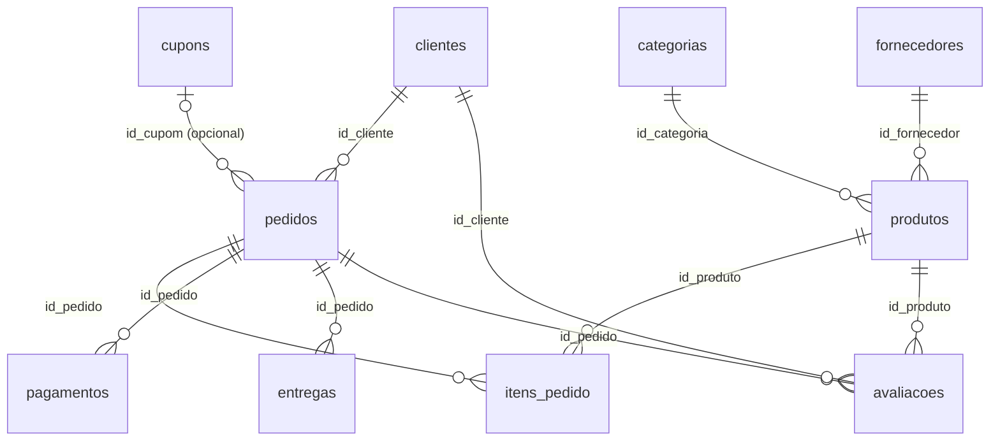

# Modelo de Dados — Origem MongoDB

Documentação da modelagem da camada de **origem** do pipeline (issue #6).

A origem dos dados é um banco **NoSQL (MongoDB)** que simula a operação de um
**e-commerce fictício**. Os dados são gerados artificialmente com a biblioteca
[Faker](https://faker.readthedocs.io/) (locale `pt_BR`) pelos scripts em
`dataset/scripts_py/` e materializados em CSV em `dataset/arquivos_csv/`.

- **Banco:** `ecommerce`
- **Coleções:** 10
- **Volume:** 15.000 documentos por coleção
- **Janela temporal:** datas distribuídas entre `2023-01-01` e `2026-06-11` (≈ 3 anos)
- **Modelagem:** referenciada — coleções separadas relacionadas por IDs inteiros
  (não há documentos aninhados/embedded)

## Visão geral das coleções

| # | Coleção | Documentos | Papel |
|---|---------|-----------:|-------|
| 1 | `clientes` | 15.000 | Cadastro de clientes |
| 2 | `categorias` | 15.000 | Categorias de produtos |
| 3 | `fornecedores` | 15.000 | Fornecedores dos produtos |
| 4 | `produtos` | 15.000 | Catálogo de produtos |
| 5 | `cupons` | 15.000 | Cupons de desconto |
| 6 | `pedidos` | 15.000 | Cabeçalho dos pedidos |
| 7 | `itens_pedido` | 15.000 | Itens (linhas) dos pedidos |
| 8 | `pagamentos` | 15.000 | Pagamentos dos pedidos |
| 9 | `entregas` | 15.000 | Entregas dos pedidos |
| 10 | `avaliacoes` | 15.000 | Avaliações de produtos |

## Diagrama de relacionamentos



> Os relacionamentos são feitos por **chave inteira** (ex.: `pedidos.id_cliente`
> referencia `clientes.id_cliente`). Não são usados `ObjectId` de referência —
> os IDs são sequenciais (`1..15000`) gerados pelos scripts.

## Estratégia de carga incremental

**Todas** as coleções possuem o campo **`updated_at`** (data/hora da última
alteração do documento). Esse campo é o controle usado para a carga incremental
do pipeline (issue #30): a ingestão busca apenas documentos com
`updated_at` maior que o último checkpoint processado. Dimensões aplicam
SCD Tipo 2 e fatos usam tabela de checkpoint.

---

## Dicionário de dados

Tipos expressos em **BSON**. Campos de data são armazenados como `date`
(ISODate), não como string.

### 1. `clientes`

| Campo | Tipo | Obrigatório | Descrição |
|-------|------|:-----------:|-----------|
| `id_cliente` | int | sim | Identificador único (1..15000) |
| `nome` | string | sim | Nome completo |
| `email` | string | sim | E-mail |
| `cpf` | string | sim | CPF formatado |
| `telefone` | string | sim | Telefone |
| `data_nascimento` | date | sim | Data de nascimento |
| `genero` | string | sim | `M`, `F` ou `Outro` |
| `logradouro` | string | sim | Endereço |
| `cidade` | string | sim | Cidade |
| `estado` | string | sim | UF (sigla de 2 letras) |
| `cep` | string | sim | CEP |
| `data_cadastro` | date | sim | Data de cadastro |
| `updated_at` | date | sim | Última atualização (carga incremental) |

### 2. `categorias`

| Campo | Tipo | Obrigatório | Descrição |
|-------|------|:-----------:|-----------|
| `id_categoria` | int | sim | Identificador único |
| `nome_categoria` | string | sim | Nome da categoria |
| `descricao` | string | sim | Descrição |
| `updated_at` | date | sim | Última atualização |

### 3. `fornecedores`

| Campo | Tipo | Obrigatório | Descrição |
|-------|------|:-----------:|-----------|
| `id_fornecedor` | int | sim | Identificador único |
| `nome_fornecedor` | string | sim | Razão social |
| `cnpj` | string | sim | CNPJ formatado |
| `email` | string | sim | E-mail corporativo |
| `telefone` | string | sim | Telefone |
| `logradouro` | string | sim | Endereço |
| `cidade` | string | sim | Cidade |
| `estado` | string | sim | UF |
| `cep` | string | sim | CEP |
| `updated_at` | date | sim | Última atualização |

### 4. `produtos`

| Campo | Tipo | Obrigatório | Descrição |
|-------|------|:-----------:|-----------|
| `id_produto` | int | sim | Identificador único |
| `nome_produto` | string | sim | Nome do produto |
| `descricao` | string | sim | Descrição |
| `preco` | double | sim | Preço de venda |
| `estoque` | int | sim | Quantidade em estoque (0..500) |
| `id_categoria` | int | sim | → `categorias.id_categoria` |
| `id_fornecedor` | int | sim | → `fornecedores.id_fornecedor` |
| `marca` | string | sim | Marca |
| `peso_kg` | double | sim | Peso em kg |
| `updated_at` | date | sim | Última atualização |

### 5. `cupons`

| Campo | Tipo | Obrigatório | Descrição |
|-------|------|:-----------:|-----------|
| `id_cupom` | int | sim | Identificador único |
| `codigo` | string | sim | Código do cupom (único) |
| `desconto_percentual` | int | sim | Percentual de desconto (5..50) |
| `valor_minimo` | int | sim | Valor mínimo da compra |
| `data_validade` | date | sim | Validade do cupom |
| `ativo` | bool | sim | Cupom ativo |
| `updated_at` | date | sim | Última atualização |

### 6. `pedidos`

| Campo | Tipo | Obrigatório | Descrição |
|-------|------|:-----------:|-----------|
| `id_pedido` | int | sim | Identificador único |
| `id_cliente` | int | sim | → `clientes.id_cliente` |
| `data_pedido` | date | sim | Data do pedido |
| `status` | string | sim | `pendente`, `processando`, `enviado`, `entregue`, `cancelado` |
| `valor_total` | double | sim | Valor total do pedido |
| `id_cupom` | int \| null | não | → `cupons.id_cupom` (nulo quando sem cupom) |
| `updated_at` | date | sim | Última atualização |

### 7. `itens_pedido`

| Campo | Tipo | Obrigatório | Descrição |
|-------|------|:-----------:|-----------|
| `id_item` | int | sim | Identificador único |
| `id_pedido` | int | sim | → `pedidos.id_pedido` |
| `id_produto` | int | sim | → `produtos.id_produto` |
| `quantidade` | int | sim | Quantidade (1..10) |
| `valor_unitario` | double | sim | Valor unitário |
| `desconto_percentual` | double | sim | Desconto aplicado (%) |
| `subtotal` | double | sim | `quantidade * valor_unitario * (1 - desconto)` |
| `updated_at` | date | sim | Última atualização |

### 8. `pagamentos`

| Campo | Tipo | Obrigatório | Descrição |
|-------|------|:-----------:|-----------|
| `id_pagamento` | int | sim | Identificador único |
| `id_pedido` | int | sim | → `pedidos.id_pedido` |
| `forma_pagamento` | string | sim | `cartao_credito`, `cartao_debito`, `pix`, `boleto` |
| `status_pagamento` | string | sim | `aprovado`, `pendente`, `recusado`, `estornado` |
| `valor` | double | sim | Valor pago |
| `data_pagamento` | date | sim | Data do pagamento |
| `parcelas` | int | sim | Nº de parcelas (1..12) |
| `updated_at` | date | sim | Última atualização |

### 9. `entregas`

| Campo | Tipo | Obrigatório | Descrição |
|-------|------|:-----------:|-----------|
| `id_entrega` | int | sim | Identificador único |
| `id_pedido` | int | sim | → `pedidos.id_pedido` |
| `status_entrega` | string | sim | `pendente`, `em_transito`, `entregue`, `devolvido` |
| `data_envio` | date | sim | Data de envio |
| `data_entrega_prevista` | date | sim | Previsão de entrega |
| `data_entrega_real` | date \| null | não | Entrega efetiva (nulo se não entregue) |
| `transportadora` | string | sim | `Correios`, `JadLog`, `Total Express`, `Loggi`, `Azul Cargo`, `Latam Cargo`, `DHL`, `FedEx` |
| `codigo_rastreio` | string | sim | Código de rastreio |
| `updated_at` | date | sim | Última atualização |

### 10. `avaliacoes`

| Campo | Tipo | Obrigatório | Descrição |
|-------|------|:-----------:|-----------|
| `id_avaliacao` | int | sim | Identificador único |
| `id_pedido` | int | sim | → `pedidos.id_pedido` |
| `id_cliente` | int | sim | → `clientes.id_cliente` |
| `id_produto` | int | sim | → `produtos.id_produto` |
| `nota` | int | sim | Nota de 1 a 5 |
| `comentario` | string | sim | Comentário textual |
| `data_avaliacao` | date | sim | Data da avaliação |
| `updated_at` | date | sim | Última atualização |

---

## Validação de schema

A definição machine-readable de cada coleção está em
[`mongodb/schemas/`](https://github.com/olucasoliverio/Engenharia_Dados_Final/tree/main/mongodb/schemas)
no formato [`$jsonSchema`](https://www.mongodb.com/docs/manual/core/schema-validation/)
do MongoDB. Esses validadores são aplicados na criação das coleções (issues #8/#9).

O exemplo abaixo é **lido diretamente do arquivo no repositório** (via
`pymdownx.snippets`), então acompanha automaticamente qualquer alteração no código:

```json title="mongodb/schemas/clientes.schema.json"
--8<-- "mongodb/schemas/clientes.schema.json"
```

## Observações sobre integridade

Os dados são simulados de forma independente por coleção, então **não há
garantia de consistência referencial nem aritmética** na origem:

- as chaves estrangeiras são sorteadas no intervalo `1..15000`, podendo apontar
  para qualquer documento existente;
- `pedidos.valor_total` é independente da soma de `itens_pedido.subtotal`;
- `pagamentos.valor` é independente de `pedidos.valor_total`.

Essas inconsistências são esperadas em uma origem bruta e serão tratadas/
reconciliadas nas camadas **Silver** e **Gold** do pipeline.

## Referências

- [MongoDB — Documentação](https://www.mongodb.com/docs/)
- [Schema Validation (`$jsonSchema`)](https://www.mongodb.com/docs/manual/core/schema-validation/)
- [Faker](https://faker.readthedocs.io/)
- Página completa de [referências](referencias.md)
