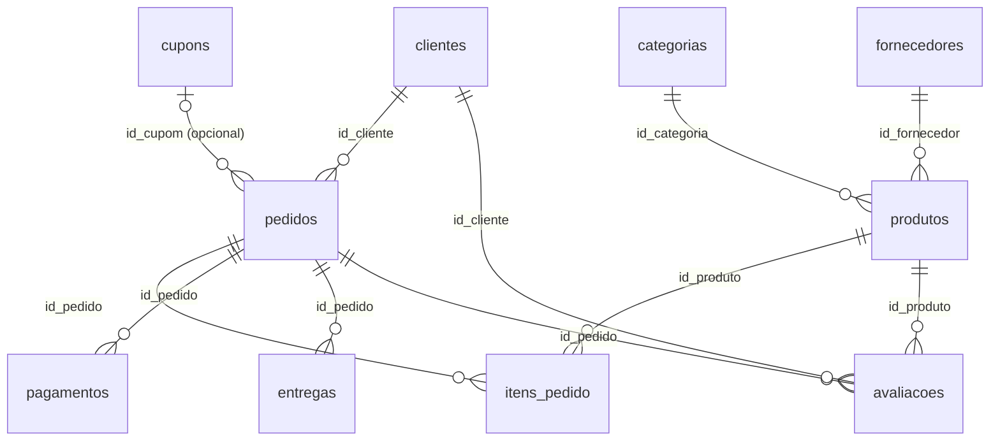

---
tags:
  - mongodb
  - modelagem
  - origem
---

# Modelo de Dados — Origem MongoDB

Documentação da modelagem da camada de **origem** do pipeline (issue #6). A origem
é um banco **NoSQL (MongoDB)** que simula a operação de um e-commerce fictício,
com dados sintéticos prontos para serem ingeridos pelas camadas Bronze → Silver → Gold.

!!! abstract "Em resumo"
    - **Banco:** `ecommerce` · **Coleções:** 10 · **Volume:** 15.000 documentos por coleção.
    - **Dados sintéticos** gerados com [Faker](https://faker.readthedocs.io/) (locale `pt_BR`)
      pelos scripts em `dataset/scripts_py/`, materializados em CSV em `dataset/arquivos_csv/`
      e carregados no Mongo por [`carregar_mongo.py`](#como-os-csvs-viram-documentos).
    - **Modelagem referenciada** (sem documentos aninhados): coleções separadas ligadas por
      **IDs inteiros** (`1..15000`), não por `ObjectId`.
    - **Carga incremental** controlada pelo campo **`updated_at`** presente em todas as coleções.
    - **Validação na origem** via [`$jsonSchema`](#validacao-de-schema) aplicado na criação de cada coleção.

## Por que NoSQL como origem?

O objetivo do trabalho é exercitar um pipeline de engenharia de dados **de ponta a ponta**,
e o MongoDB foi escolhido como origem por refletir um cenário realista de sistemas
transacionais modernos:

!!! note "Motivação"
    - **Schema flexível**: documentos JSON/BSON são o formato nativo de muitas aplicações web,
      então a ingestão precisa lidar com tipos semiestruturados e campos opcionais (ex.: `id_cupom`
      e `data_entrega_real`, que podem ser nulos).
    - **Heterogeneidade de tipos**: datas como `ISODate`, números como `int`/`double`, flags como
      `bool` — exige uma etapa explícita de conversão e tipagem na entrada do pipeline.
    - **Origem desnormalizada/inconsistente por natureza**: por ser uma base operacional simulada,
      não há garantia de integridade referencial perfeita, o que justifica as camadas de
      limpeza/conformação (Silver e Gold).

Apesar de o MongoDB permitir **embedding** (documentos aninhados), a modelagem aqui é
deliberadamente **referenciada** — uma coleção por entidade ligada por chave inteira. Isso
mantém a origem próxima de um modelo relacional, facilitando o mapeamento posterior para o
modelo dimensional (fatos e dimensões) das camadas Silver/Gold.

## Visão geral das coleções

| # | Coleção | Documentos | Papel | Chave primária |
|---|---------|-----------:|-------|----------------|
| 1 | `clientes` | 15.000 | Cadastro de clientes | `id_cliente` |
| 2 | `categorias` | 15.000 | Categorias de produtos | `id_categoria` |
| 3 | `fornecedores` | 15.000 | Fornecedores dos produtos | `id_fornecedor` |
| 4 | `produtos` | 15.000 | Catálogo de produtos | `id_produto` |
| 5 | `cupons` | 15.000 | Cupons de desconto | `id_cupom` |
| 6 | `pedidos` | 15.000 | Cabeçalho dos pedidos | `id_pedido` |
| 7 | `itens_pedido` | 15.000 | Itens (linhas) dos pedidos | `id_item` |
| 8 | `pagamentos` | 15.000 | Pagamentos dos pedidos | `id_pagamento` |
| 9 | `entregas` | 15.000 | Entregas dos pedidos | `id_entrega` |
| 10 | `avaliacoes` | 15.000 | Avaliações de produtos | `id_avaliacao` |

!!! info "Janela temporal"
    Os campos de data são distribuídos uniformemente entre `2023-01-01` e `2026-06-11`
    (≈ 3,5 anos). Os geradores fixam as sementes do `Faker` e do `random`
    (`Faker.seed(...)` / `random.seed(...)`), portanto **a geração é determinística**:
    rodar os scripts novamente produz exatamente o mesmo dataset.

## Diagrama de relacionamentos



!!! warning "Relacionamentos por chave inteira, não por `ObjectId`"
    Os relacionamentos são feitos por **chave inteira** (ex.: `pedidos.id_cliente`
    referencia `clientes.id_cliente`). Não são usados `ObjectId` de referência: os IDs
    são sequenciais (`1..15000`) gerados pelos scripts. As **chaves estrangeiras são
    sorteadas** no intervalo `1..15000` (ex.: `random.randint(1, TOTAL)` em
    `gerar_pedidos.py`), então o MongoDB **não impõe** essa integridade — ela é apenas
    convencional.

## Como os dados são gerados

Cada entidade tem seu próprio script em `dataset/scripts_py/` que produz um CSV. Os
scripts seguem o mesmo padrão: fixam as sementes, definem listas de domínio (estados,
status, marcas...) e geram 15.000 registros com IDs sequenciais.

=== "clientes"

    Datas coerentes entre si: `updated_at` nunca é anterior a `data_cadastro` — ele é
    sorteado **dentro da janela que vai do cadastro até o fim do período**.

    ```python title="dataset/scripts_py/gerar_clientes.py"
    --8<-- "dataset/scripts_py/gerar_clientes.py:30:50"
    ```

=== "pedidos"

    Status com **distribuição ponderada** (`entregue` ≈ 55%) e cupom presente em
    apenas **25%** dos pedidos (`random.random() < 0.25`); caso contrário `id_cupom` é
    `None`, virando `null` no Mongo.

    ```python title="dataset/scripts_py/gerar_pedidos.py"
    --8<-- "dataset/scripts_py/gerar_pedidos.py:26:41"
    ```

=== "produtos"

    Nome composto a partir de uma lista de marcas + adjetivo + palavra aleatória; preço
    e peso são `float` arredondados.

    ```python title="dataset/scripts_py/gerar_produtos.py"
    --8<-- "dataset/scripts_py/gerar_produtos.py:32:52"
    ```

!!! tip "Coerência temporal do `updated_at`"
    Em `clientes` e `pedidos`, o `updated_at` é derivado da data de criação:

    ```python
    updated_at = data_aleatoria(data_cadastro, (fim - data_cadastro).days)
    ```

    Isso garante `data_cadastro <= updated_at <= fim`, o que torna a janela de carga
    incremental (abaixo) realista. Já em `produtos` o `updated_at` é sorteado livremente
    em toda a janela — um exemplo de inconsistência tolerada na origem bruta.

## Estratégia de carga incremental

**Todas** as coleções possuem o campo **`updated_at`** (data/hora da última alteração do
documento). Esse campo é o controle usado para a carga incremental do pipeline (issue #30).

!!! example "Como funciona"
    1. O pipeline guarda um **checkpoint** — o maior `updated_at` já processado.
    2. Na ingestão seguinte, busca apenas documentos com `updated_at` **maior** que o
       checkpoint (ex.: `{"updated_at": {"$gt": ultimo_checkpoint}}`).
    3. Atualiza o checkpoint para o novo máximo.

    Para tornar essa leitura eficiente, `carregar_mongo.py` cria um **índice ascendente
    em `updated_at`** em cada coleção (além do índice único da chave primária e dos
    índices de chaves estrangeiras).

Nas camadas de destino, **dimensões** aplicam **SCD Tipo 2** (preservando histórico) e
**fatos** usam tabela de **checkpoint** para o controle incremental.

## Como os CSVs viram documentos

O script [`carregar_mongo.py`](#) lê os 10 CSVs, converte cada célula para o tipo BSON
adequado e insere em lotes de 5.000 documentos. O coração do mapeamento é o dicionário
`COLECOES`, que declara, por coleção, quais colunas são inteiras, decimais, booleanas,
datas e quais são chaves estrangeiras (usadas para criar índices).

??? info "Mapa de tipos por coleção (`COLECOES`)"
    Este dicionário é a fonte da verdade da tipagem na carga. Cada coleção informa o CSV
    de origem, a chave primária (`pk`), e as listas `int`/`float`/`bool`/`date`/`fk`.

    ```python title="dataset/scripts_py/carregar_mongo.py"
    --8<-- "dataset/scripts_py/carregar_mongo.py:47:138"
    ```

A conversão de cada célula segue regras simples e explícitas — campos vazios viram
`null`, datas ISO viram `datetime` (ISODate), e o resto cai no tipo declarado:

```python title="dataset/scripts_py/carregar_mongo.py"
--8<-- "dataset/scripts_py/carregar_mongo.py:165:177"
```

!!! note "Detalhes da carga"
    - **Idempotência**: a coleção é recriada a cada execução (`db.drop_collection(nome)`
      seguido de `create_collection`), então rodar o script de novo regenera o estado.
    - **Booleanos** aceitam `true`, `1` ou `sim` (case-insensitive) como verdadeiro.
    - **Inteiros** passam por `int(float(valor))`, tolerando valores como `"3.0"`.
    - **Inserção em lote** com `insert_many(..., ordered=False)` para desempenho.
    - **Índices** criados ao final: PK única, cada FK e `updated_at`.

A criação da coleção, a inserção em lote e os índices ficam em `carregar_colecao`:

```python title="dataset/scripts_py/carregar_mongo.py"
--8<-- "dataset/scripts_py/carregar_mongo.py:200:228"
```

---

## Dicionário de dados

Tipos expressos em **BSON**. Campos de data são armazenados como `date` (ISODate), não
como string. As colunas listadas como `int`/`float`/`bool`/`date` abaixo correspondem
exatamente ao mapa `COLECOES` de `carregar_mongo.py`.

### 1. `clientes`

| Campo | Tipo | Obrigatório | Descrição |
|-------|------|:-----------:|-----------|
| `id_cliente` | int | sim | Identificador único (1..15000) |
| `nome` | string | sim | Nome completo |
| `email` | string | sim | E-mail |
| `cpf` | string | sim | CPF formatado |
| `telefone` | string | sim | Telefone |
| `data_nascimento` | date | sim | Data de nascimento (idade 18..75) |
| `genero` | string | sim | `M`, `F` ou `Outro` (validado por `enum`) |
| `logradouro` | string | sim | Endereço |
| `cidade` | string | sim | Cidade |
| `estado` | string | sim | UF (sigla de exatamente 2 letras) |
| `cep` | string | sim | CEP |
| `data_cadastro` | date | sim | Data de cadastro |
| `updated_at` | date | sim | Última atualização (≥ `data_cadastro`) — carga incremental |

### 2. `categorias`

| Campo | Tipo | Obrigatório | Descrição |
|-------|------|:-----------:|-----------|
| `id_categoria` | int | sim | Identificador único |
| `nome_categoria` | string | sim | Nome da categoria |
| `descricao` | string | sim | Descrição |
| `updated_at` | date | sim | Última atualização |

### 3. `fornecedores`

| Campo | Tipo | Obrigatório | Descrição |
|-------|------|:-----------:|-----------|
| `id_fornecedor` | int | sim | Identificador único |
| `nome_fornecedor` | string | sim | Razão social |
| `cnpj` | string | sim | CNPJ formatado |
| `email` | string | sim | E-mail corporativo |
| `telefone` | string | sim | Telefone |
| `logradouro` | string | sim | Endereço |
| `cidade` | string | sim | Cidade |
| `estado` | string | sim | UF |
| `cep` | string | sim | CEP |
| `updated_at` | date | sim | Última atualização |

### 4. `produtos`

| Campo | Tipo | Obrigatório | Descrição |
|-------|------|:-----------:|-----------|
| `id_produto` | int | sim | Identificador único |
| `nome_produto` | string | sim | Nome do produto (marca + adjetivo + palavra) |
| `descricao` | string | sim | Descrição |
| `preco` | double | sim | Preço de venda (≈ 9,90..4999,90) |
| `estoque` | int | sim | Quantidade em estoque (0..500) |
| `id_categoria` | int | sim | → `categorias.id_categoria` |
| `id_fornecedor` | int | sim | → `fornecedores.id_fornecedor` |
| `marca` | string | sim | Marca |
| `peso_kg` | double | sim | Peso em kg (0,1..30,0) |
| `updated_at` | date | sim | Última atualização |

### 5. `cupons`

| Campo | Tipo | Obrigatório | Descrição |
|-------|------|:-----------:|-----------|
| `id_cupom` | int | sim | Identificador único |
| `codigo` | string | sim | Código do cupom (único) |
| `desconto_percentual` | int | sim | Percentual de desconto (5..50) |
| `valor_minimo` | int | sim | Valor mínimo da compra |
| `data_validade` | date | sim | Validade do cupom |
| `ativo` | bool | sim | Cupom ativo |
| `updated_at` | date | sim | Última atualização |

### 6. `pedidos`

| Campo | Tipo | Obrigatório | Descrição |
|-------|------|:-----------:|-----------|
| `id_pedido` | int | sim | Identificador único |
| `id_cliente` | int | sim | → `clientes.id_cliente` |
| `data_pedido` | date | sim | Data do pedido |
| `status` | string | sim | `pendente`, `processando`, `enviado`, `entregue`, `cancelado` (ponderado: `entregue` ≈ 55%) |
| `valor_total` | double | sim | Valor total do pedido (20,00..3000,00) |
| `id_cupom` | int \| null | não | → `cupons.id_cupom` (nulo em ≈ 75% dos pedidos) |
| `updated_at` | date | sim | Última atualização (≥ `data_pedido`) |

### 7. `itens_pedido`

| Campo | Tipo | Obrigatório | Descrição |
|-------|------|:-----------:|-----------|
| `id_item` | int | sim | Identificador único |
| `id_pedido` | int | sim | → `pedidos.id_pedido` |
| `id_produto` | int | sim | → `produtos.id_produto` |
| `quantidade` | int | sim | Quantidade (1..4) |
| `valor_unitario` | double | sim | Valor unitário |
| `desconto_percentual` | double | sim | Desconto aplicado (%) |
| `subtotal` | double | sim | `quantidade * valor_unitario * (1 - desconto)` |
| `updated_at` | date | sim | Última atualização |

### 8. `pagamentos`

| Campo | Tipo | Obrigatório | Descrição |
|-------|------|:-----------:|-----------|
| `id_pagamento` | int | sim | Identificador único |
| `id_pedido` | int | sim | → `pedidos.id_pedido` |
| `forma_pagamento` | string | sim | `cartao_credito`, `cartao_debito`, `pix`, `boleto` |
| `status_pagamento` | string | sim | `aprovado`, `pendente`, `recusado`, `estornado` |
| `valor` | double | sim | Valor pago |
| `data_pagamento` | date | sim | Data do pagamento |
| `parcelas` | int | sim | Nº de parcelas (1..12) |
| `updated_at` | date | sim | Última atualização |

### 9. `entregas`

| Campo | Tipo | Obrigatório | Descrição |
|-------|------|:-----------:|-----------|
| `id_entrega` | int | sim | Identificador único |
| `id_pedido` | int | sim | → `pedidos.id_pedido` |
| `status_entrega` | string | sim | `pendente`, `em_transito`, `entregue`, `devolvido` |
| `data_envio` | date | sim | Data de envio |
| `data_entrega_prevista` | date | sim | Previsão de entrega |
| `data_entrega_real` | date \| null | não | Entrega efetiva (nulo se não entregue) |
| `transportadora` | string | sim | `Correios`, `JadLog`, `Total Express`, `Loggi`, `Azul Cargo`, `Latam Cargo`, `DHL`, `FedEx` |
| `codigo_rastreio` | string | sim | Código de rastreio |
| `updated_at` | date | sim | Última atualização |

### 10. `avaliacoes`

| Campo | Tipo | Obrigatório | Descrição |
|-------|------|:-----------:|-----------|
| `id_avaliacao` | int | sim | Identificador único |
| `id_pedido` | int | sim | → `pedidos.id_pedido` |
| `id_cliente` | int | sim | → `clientes.id_cliente` |
| `id_produto` | int | sim | → `produtos.id_produto` |
| `nota` | int | sim | Nota de 1 a 5 |
| `comentario` | string | sim | Comentário textual |
| `data_avaliacao` | date | sim | Data da avaliação |
| `updated_at` | date | sim | Última atualização |

---

## Exemplos de documentos

Como ficam os documentos no MongoDB depois da conversão de tipos (datas como ISODate,
inteiros e decimais nativos):

=== "clientes"

    ```json
    {
      "_id": "ObjectId('...')",
      "id_cliente": 1,
      "nome": "Ana Beatriz da Rocha",
      "email": "ana.rocha@example.com",
      "cpf": "123.456.789-00",
      "telefone": "+55 11 99999-0001",
      "data_nascimento": "ISODate('1990-04-12T00:00:00Z')",
      "genero": "F",
      "logradouro": "Rua das Acácias, 100",
      "cidade": "São Paulo",
      "estado": "SP",
      "cep": "01234-567",
      "data_cadastro": "ISODate('2023-03-15T00:00:00Z')",
      "updated_at": "ISODate('2024-08-01T00:00:00Z')"
    }
    ```

=== "pedidos (com cupom)"

    ```json
    {
      "_id": "ObjectId('...')",
      "id_pedido": 42,
      "id_cliente": 8123,
      "data_pedido": "ISODate('2024-05-20T00:00:00Z')",
      "status": "entregue",
      "valor_total": 459.90,
      "id_cupom": 311,
      "updated_at": "ISODate('2024-06-02T00:00:00Z')"
    }
    ```

=== "pedidos (sem cupom)"

    ```json
    {
      "_id": "ObjectId('...')",
      "id_pedido": 43,
      "id_cliente": 277,
      "data_pedido": "ISODate('2025-01-10T00:00:00Z')",
      "status": "processando",
      "valor_total": 1280.00,
      "id_cupom": null,
      "updated_at": "ISODate('2025-01-12T00:00:00Z')"
    }
    ```

## Validação de schema

A definição machine-readable de cada coleção está em
[`dataset/schemas/`](https://github.com/olucasoliverio/Engenharia_Dados_Final/tree/main/dataset/schemas)
no formato [`$jsonSchema`](https://www.mongodb.com/docs/manual/core/schema-validation/) do
MongoDB. Esses validadores são aplicados na **criação** das coleções por
`carregar_mongo.py` (issues #8/#9) e podem ser desativados com `--no-validator`.

!!! tip "O que o validador garante"
    - **Campos obrigatórios** via `required` (ex.: `id_cliente`, `nome`, `updated_at`).
    - **Tipos BSON** por campo — note `["int", "long"]` nos IDs, aceitando inteiros de
      32 e 64 bits, e `["int", "long", "null"]` em `pedidos.id_cupom`.
    - **Domínios fechados** via `enum` (ex.: `genero` ∈ `M/F/Outro`; `status` do pedido).
    - **Restrições de formato** (ex.: `estado` com `minLength`/`maxLength` = 2).

Os exemplos abaixo são **lidos diretamente dos arquivos no repositório** (via
`pymdownx.snippets`), então acompanham automaticamente qualquer alteração no código:

=== "clientes.schema.json"

    ```json title="dataset/schemas/clientes.schema.json"
    --8<-- "dataset/schemas/clientes.schema.json"
    ```

=== "pedidos.schema.json"

    ```json title="dataset/schemas/pedidos.schema.json"
    --8<-- "dataset/schemas/pedidos.schema.json"
    ```

## Observações sobre integridade

Os dados são simulados de forma independente por coleção, então **não há garantia de
consistência referencial nem aritmética** na origem:

- as **chaves estrangeiras são sorteadas** no intervalo `1..15000` (ex.:
  `random.randint(1, TOTAL)`), podendo apontar para qualquer documento existente — ou
  para combinações sem sentido de negócio;
- `pedidos.valor_total` é **independente** da soma de `itens_pedido.subtotal`;
- `pagamentos.valor` é **independente** de `pedidos.valor_total`;
- o `updated_at` de algumas entidades (ex.: `produtos`) é sorteado em toda a janela, sem
  vínculo com uma data de criação.

!!! warning "Tratamento nas camadas seguintes"
    Essas inconsistências são **esperadas** em uma origem bruta. A validação de
    integridade referencial, a reconciliação aritmética e a deduplicação são
    responsabilidade das camadas **Silver** (limpeza/conformação) e **Gold**
    (modelo dimensional) do pipeline — não da origem.

## Referências

- [MongoDB — Documentação](https://www.mongodb.com/docs/)
- [Schema Validation (`$jsonSchema`)](https://www.mongodb.com/docs/manual/core/schema-validation/)
- [Índices no MongoDB](https://www.mongodb.com/docs/manual/indexes/)
- [Faker](https://faker.readthedocs.io/)
- Página completa de [referências](referencias.md)
